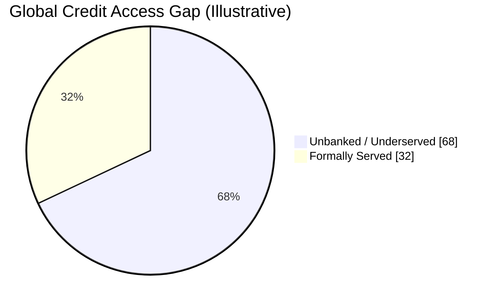
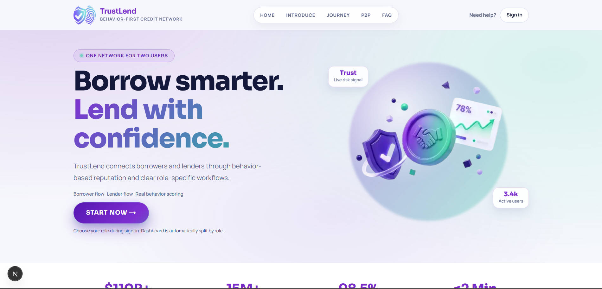
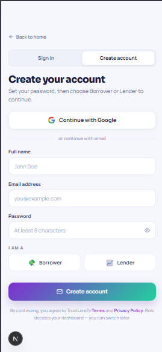
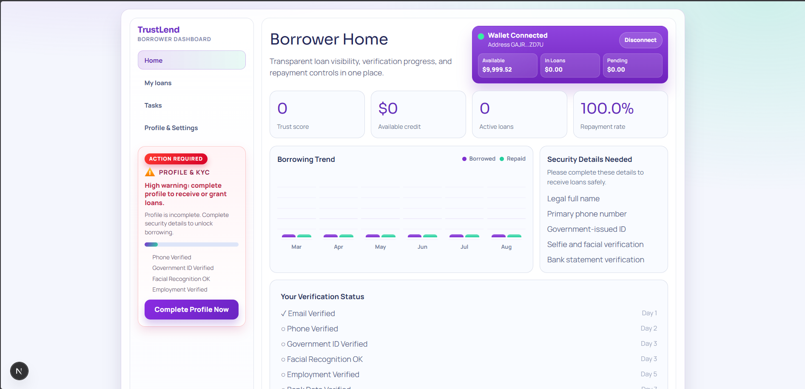
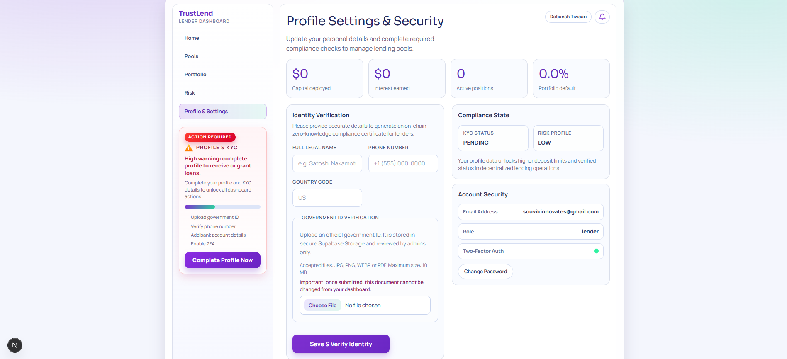
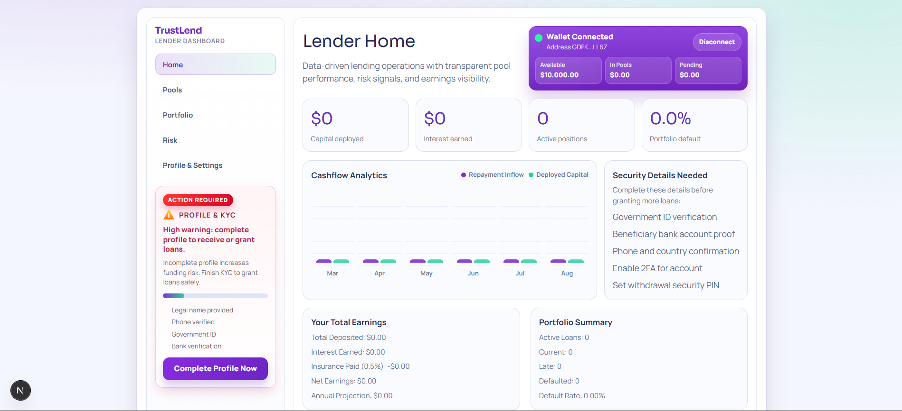
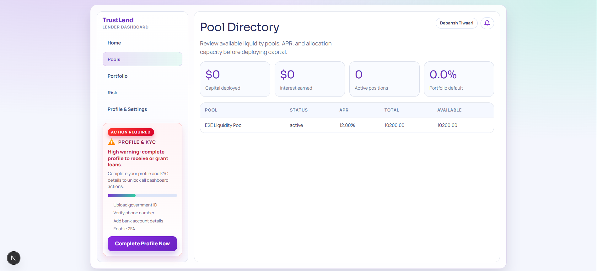
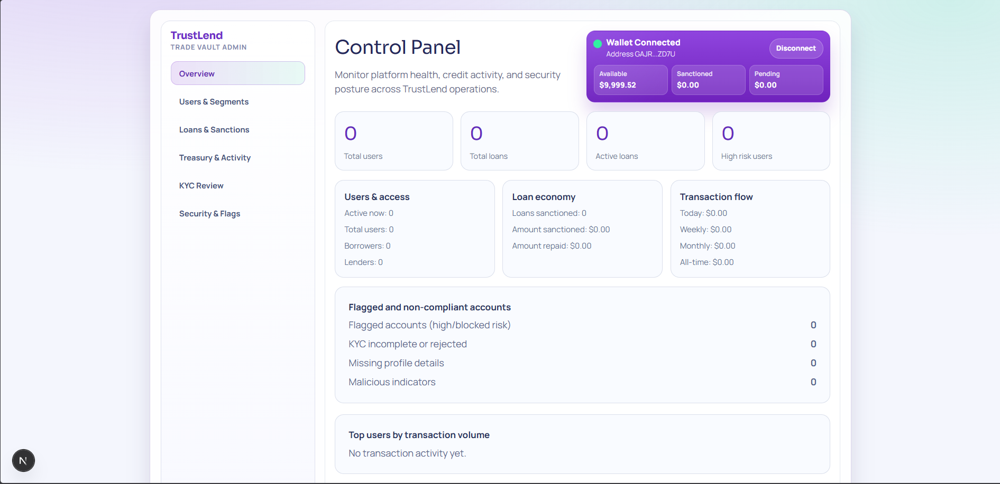
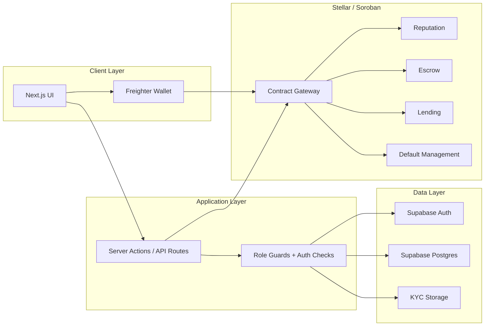

<p align="center">
  
</p>

<h1 align="center">TrustLend</h1>

<p align="center"><em>Reputation-driven micro-lending on Stellar and Soroban, supported by Supabase identity, KYC, and operational data.</em></p>

<p align="center">
  
  
  
  
  
  
</p>

<p align="center">Fast lending. Transparent controls. Auditable workflows. Global access.</p>

<p align="center"><strong>Live App:</strong> <a href="https://trustlendborrow.vercel.app/">trustlend.vercel.app</a></p>

---

## Overview

TrustLend is a decentralized lending platform that connects borrowers and lenders through a hybrid architecture:

- Next.js for the web app and dashboards
- Supabase for authentication, database state, storage, and KYC records
- Stellar and Soroban for contract-driven lending logic

The platform is designed to make lending more transparent, easier to audit, and faster to evaluate.

## Problem Statement

Traditional lending systems still exclude many users because they rely heavily on collateral, formal credit history, or slow manual review. TrustLend addresses that gap with:

- reputation-based borrower scoring
- role-aware application flows
- smart-contract-backed lending lifecycle management
- identity verification and operational state in Supabase

## Impact Snapshot

| Metric | Value | Meaning |
|---|---:|---|
| Unbanked adults globally | 1.7B+ | Large underserved audience |
| Typical savings APY | ~0.5% | Idle capital earns too little |
| TrustLend target yield | 10% to 15% | Better upside for lenders |
| Decision speed target | Minutes to hours | Faster than legacy underwriting |

### Credit Gap Distribution



## Product Highlights

- Borrower and lender dashboards
- Admin workspace for oversight and verification
- KYC submission and review
- Lending pool deposit and withdrawal flows
- Loan request, repayment, and status tracking
- On-chain contract verification with off-chain app state

## Product Screenshots

### Landing



### Mobile Views

<p align="center">
  
  
</p>

### Borrower Dashboard



### Borrower Profile



### Lender Dashboard



### Lending Pool



### Admin Dashboard



## Architecture



## File Structure

```text
trustlend/
|- app/                    # App Router pages, API routes, actions
|- components/             # UI, dashboard, auth, landing components
|- contracts/              # Soroban contracts + deployment scripts
|- docs/                   # Setup, testing, and domain guides
|- lib/                    # Auth, Supabase, Stellar, and contract helpers
|- public/                 # Static assets and images
|- sql/                    # Schema and RLS migrations
|- types/                  # Shared TypeScript types
|- package.json            # Scripts and dependencies
|- next.config.ts          # Next.js config
|- tsconfig.json           # TypeScript config
```

## Tech Stack

| Layer | Technology |
|---|---|
| Frontend | Next.js 16, React 19, TypeScript, Tailwind CSS 4, Framer Motion |
| Auth + Database | Supabase Auth, PostgreSQL, Supabase Storage |
| Blockchain | Stellar Testnet, Soroban RPC, Horizon API |
| Wallet | Freighter Wallet, @stellar/freighter-api |
| Smart Contracts | Rust (Soroban), wasm32v1-none target |
| Tooling | ESLint 9, Node.js, Cargo, Stellar CLI |

## Contract Deployment Details

> Contract IDs below are the currently deployed Testnet addresses.

| Contract | Env Key | Contract ID | Verification Tx |
|---|---|---|---|
| Borrower Reputation | `NEXT_PUBLIC_REPUTATION_CONTRACT_ID` | `CBPU62PW6LZFGZQPCETQ4YFNHBHWUN2BGNPHLJ5U2CYB6XPL7DAIC23X` | [View](https://stellar.expert/explorer/testnet/tx/f4cb6fdb4562cf5875cde9357ae4a67c8be001d5c9278cedcba7104dafc29a5f) |
| Escrow | `NEXT_PUBLIC_ESCROW_CONTRACT_ID` | `CAOSPG65ZSJAEZCYADGMKJGEM3TE6H3NXMSS3SDC2QAIATODJ54CCNTR` | [View](https://stellar.expert/explorer/testnet/tx/44cdaaafc748575ba17ae8677795f118ed672778bd675b5eda59ae2ff352ca71) |
| Lending | `NEXT_PUBLIC_LENDING_CONTRACT_ID` | `CCQZ5XJGSAGSP7OQJ2RFQLSMHVUXN6LWFAK6CEROHW7FRNA4JQOQHG7X` | [View](https://stellar.expert/explorer/testnet/tx/4171ac762bbd9254ca3a091c6f3725114c3f32810bc43bc9abde3b3d5cf9b9a7) |
| Default Management | `NEXT_PUBLIC_DEFAULT_CONTRACT_ID` | `CBCJRWJNZ7G5T7U7LG3YOENCF3IM3ZZSG2ZCTUJTL3FUWNPKC6A2T77W` | [View](https://stellar.expert/explorer/testnet/tx/5a3483b628da6abd0a63250f09fc982e764841552e7c6356936ab510b88d2e95) |

### Deployment Credentials

| Field | Value |
|---|---|
| Network | Stellar Testnet |
| Admin Address | `GAJRNUO6HSMQG4FNHNWQVRXJZJZ7QRA7HXPYYB6H5PTA3EAAJXJNZD7U` |
| Source Key Alias | `trustlend-admin` |

## Soroban Integration Standard

The project uses the standard Soroban `Contract` class flow rather than low-level host-function calls.

- `new Contract(contractId)` for contract instances
- `contract.call(method, ...args)` for read and write operations
- `simulateTransaction(...)` and `assembleTransaction(...)` for transaction preparation

Reviewer links:

- [lib/stellar/soroban.ts#L108](lib/stellar/soroban.ts#L108)
- [lib/stellar/soroban.ts#L114](lib/stellar/soroban.ts#L114)
- [lib/stellar/soroban.ts#L119](lib/stellar/soroban.ts#L119)
- [lib/stellar/soroban.ts#L125](lib/stellar/soroban.ts#L125)
- [lib/stellar/soroban.ts#L179](lib/stellar/soroban.ts#L179)
- [lib/stellar/soroban.ts#L185](lib/stellar/soroban.ts#L185)
- [lib/stellar/soroban.ts#L189](lib/stellar/soroban.ts#L189)

## User Guide

### Borrower

1. Sign in and open [Borrower Dashboard](/dashboard/borrower).
2. Go to [Profile Settings & Verification](/dashboard/borrower/profile).
3. Fill in your legal name, phone, and country code.
4. Upload your government ID.
5. Save the profile and wait for KYC review.
6. Apply for a loan after your profile is accepted.
7. Repay the loan and confirm the status changes to `repaid`.

### Lender

1. Sign in and open [Lender Dashboard](/dashboard/lender).
2. Deposit funds into an active pool.
3. Confirm the pool position updates in Supabase.
4. Withdraw part or all of your position.
5. Check ledger transactions for confirmed deposit and withdrawal rows.

### Admin

1. Sign in with the allowlisted admin email.
2. Open [Admin Dashboard](/dashboard/admin).
3. Review KYC in [Admin KYC](/dashboard/admin/kyc).
4. Inspect users, loans, fraud, and pool state.
5. Confirm admin pages render only for the correct role.

## How To Verify The Platform

### Manual Checks

- Borrower can save profile data without errors.
- Borrower can upload identity documents and see KYC state update.
- Lender can deposit and withdraw from a pool.
- Admin can access dashboards, KYC, and user pages.
- Invalid requests return validation errors instead of generic failures.

### Automated Checks

Use the full guide here:

- [docs/TESTING_GUIDE.md](docs/TESTING_GUIDE.md)

Run the seeded end-to-end flow:

```bash
npm run e2e:seed
```

## Test Results And Evidence

### Contract Test Result


### End-to-End Test Result


Checks already validated in the codebase:

- borrower, lender, and admin dashboards load
- loan apply and repayment routes work
- deposit and withdraw routes work
- role mismatch is blocked
- invalid input is rejected

## API Behavior Summary

| Scenario | Expected Response |
|---|---|
| Borrower applies with valid data | `201` |
| Borrower applies with invalid amount | `400` |
| Borrower repays valid loan | `201` |
| Lender deposits into active pool | `201` |
| Lender withdraws valid amount | `200` |
| Unauthorized role hits a protected route | redirect / access denied |

## Setup Guide

### Prerequisites

- Node.js 18+
- Rust toolchain
- Stellar CLI
- Supabase project

### Install

```bash
npm install
```

### Configure Environment

```bash
cp .env.example .env.local
```

Make sure these are set in `.env.local`:

- Supabase URL and anon key
- Soroban RPC URL
- Admin email allowlist
- Admin address
- 4 deployed contract IDs

### Run Migrations

Apply these SQL files in Supabase:

1. `sql/001_schema.sql`
2. `sql/002_rls.sql`
3. `sql/KYC_SCHEMA.sql`

### Run The App

```bash
npm run dev
```

Open:

```text
http://localhost:3000
```

### Build And Test

```bash
npm run build
npm run lint
npm run e2e:seed
```

### Deploy Contracts

```powershell
cd contracts
.\scripts\deploy.ps1
```

Or on Linux/macOS:

```bash
cd contracts
./scripts/deploy.sh
```

## Admin And Security Notes

- Admin access is gated by role and allowlist checks.
- The on-chain admin address is set during contract initialization.
- Changing `.env.local` alone does not change deployed contract IDs.
- KYC document uploads are stored in Supabase Storage.
- Service-role access is reserved for local E2E automation, not production.

## Submission Checklist

| Item | Status |
|---|---|
| README updated with unique structure | ✅ |
| File structure documented | ✅ |
| User guide added | ✅ |
| Deployment link updated | ✅ |
| Contract deployment details documented | ✅ |
| Test evidence included | ✅ |
| Role-based testing guide added | ✅ |

## Closing Note

TrustLend is designed to be understandable, testable, and auditable. The most reliable way to review it is to follow the role guide, confirm the database writes, and verify that dashboards and contract-backed flows behave consistently.
