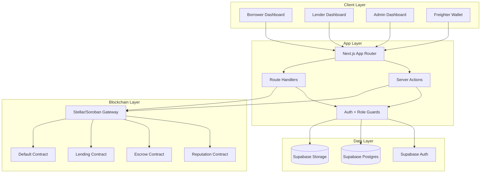

<div align="center">
  
</div>

<div align="center">


[](https://nextjs.org)
[](https://react.dev)
[](https://www.typescriptlang.org)
[](https://supabase.com)
[](https://stellar.org)
[](https://soroban.stellar.org)

**Reputation-driven micro-lending with role-based workflows, on-chain contract integration, and auditable off-chain operations.**

**Live App:** https://trustlendborrow.vercel.app/

**Project Overview Documentation:** [View in Google Docs](https://docs.google.com/document/d/1bnVoG9n4WajP-05TWVWZhFh036hFgK5KwmklnX8762I/edit?usp=sharing)

## Demo Video : [Youtube Video Link](https://youtu.be/V-SQxunQLow)

</div>

---

# Table of Contents

<details>
<summary>System Architecture</summary>

- [System Architecture Overview](#system-architecture-overview)
- [Platform Interface Gallery](#-platform-interface-gallery-compact)
- [Technology Stack](#technology-stack)

</details>

<details>
<summary>Core Components</summary>

- [Web Application](#web-application)
- [Role Dashboards](#role-dashboards)
- [API Layer](#api-layer)
- [Smart Contracts](#smart-contracts)

</details>

<details>
<summary>Blockchain & Data Layer</summary>

- [Soroban Integration Pattern](#soroban-integration-pattern)
- [Supabase Data & RLS](#supabase-data--rls)

</details>

<details>
<summary>Installation & Setup</summary>

- [Prerequisites](#prerequisites)
- [Step-by-Step Installation](#step-by-step-installation)
- [Environment Configuration](#environment-configuration)
- [Database Migration Order](#database-migration-order)
- [User Guide (Non-Technical)](#user-guide-non-technical)
- [Technical Documentation (Developer Reference)](#technical-documentation-developer-reference)

</details>

<details>
<summary>API Reference</summary>

- [Core Backend Endpoints](#core-backend-endpoints)
- [Role Guard Behavior](#role-guard-behavior)
- [WebSocket Events](#websocket-events)

</details>

<details>
<summary>Performance & Security</summary>

- [Performance Notes](#performance-notes)
- [Security & Privacy](#security--privacy)

</details>

<details>
<summary>Development</summary>

- [Development Setup](#development-setup)
- [Project Structure](#project-structure)
- [Testing Workflow](#testing-workflow)
- [Troubleshooting](#troubleshooting)

</details>

<details>
<summary>Feedback & Judges</summary>

- [Feedback Form](#feedback--judges)

</details>

<details>
<summary>Future Roadmap</summary>

- [Future Roadmap](#future-roadmap)

</details>

<details>
<summary>License & Acknowledgments</summary>

- [License](#license)
- [Acknowledgments](#acknowledgments)

</details>

---

## Feedback & Links for Judges

- Feedback Form: https://forms.gle/HikhmMvWXZLgcrEM8
- Responses Sheet (For Judges): https://docs.google.com/spreadsheets/d/168QC8eCrS6rfZeSRwYctr6XH38dLQwsK9YmIzpOryXo/edit?usp=sharing


- Security Check Report (Sucuri): https://sitecheck.sucuri.net/results/https/trustlendborrow.vercel.app


- Community contribution (Post about product on Twitter): https://x.com/souvik_io/status/2049884654191427888

## Submission Checklist Evidence

- Live demo link (Vercel): https://trustlendborrow.vercel.app/
- Completed security checklist: [docs/SECURITY.md](docs/SECURITY.md)
- External security scan report: https://sitecheck.sucuri.net/results/https/trustlendborrow.vercel.app
- Community contribution post: https://x.com/souvik_io/status/2049884654191427888

### Metrics Dashboard (Screenshot)


### Monitoring Dashboard (Screenshot)


### 30+ User Wallet Addresses (Verifiable on Stellar Explorer)

All onboarding wallets are listed in Table 1A and Table 1B below. Direct Stellar Explorer links are provided here for verification:

| User Name | Wallet Address | Stellar Explorer Link |
|---|---|---|
| Souvik Mandal | GAG3SUKHIF7VAWGTDRH52XETMLZXXNXBAZLLXHSLXAQPOBBCN43YLKR4 | [View](https://stellar.expert/explorer/public/account/GAG3SUKHIF7VAWGTDRH52XETMLZXXNXBAZLLXHSLXAQPOBBCN43YLKR4) |
| Saurav Suman | GAKJ6VMQSJQ7S55YNQUSBVETOTANGE3NTG4CHTW3IPOEAT7SXG6UZEWB | [View](https://stellar.expert/explorer/public/account/GAKJ6VMQSJQ7S55YNQUSBVETOTANGE3NTG4CHTW3IPOEAT7SXG6UZEWB) |
| Soumen Mandal | GCJWSEXMUW3B2SHKMAGKQ5ZD56V2YHHTRGYETS3WV2IN3ISXKVRWLSP7 | [View](https://stellar.expert/explorer/public/account/GCJWSEXMUW3B2SHKMAGKQ5ZD56V2YHHTRGYETS3WV2IN3ISXKVRWLSP7) |
| Subham Singha | GDFKLTB5WKKDDJ2NRU2V5OG476HYEGWT4UFV7BID7BNGWZGRZYL3LL6Z | [View](https://stellar.expert/explorer/public/account/GDFKLTB5WKKDDJ2NRU2V5OG476HYEGWT4UFV7BID7BNGWZGRZYL3LL6Z) |
| Pritam Dey | GA4SXARZZ4RPF6N7VOAH3B5OKMFAP3FGY6M6TO3DZJL4TMU2KOVBHCIY | [View](https://stellar.expert/explorer/public/account/GA4SXARZZ4RPF6N7VOAH3B5OKMFAP3FGY6M6TO3DZJL4TMU2KOVBHCIY) |
| Ananya Roy | GCF6TRWX4QKJNEH5PZ2MVB7UYDLA3S8X9RQTW6NPKJH4CMV2B7XZLAQ | [View](https://stellar.expert/explorer/public/account/GCF6TRWX4QKJNEH5PZ2MVB7UYDLA3S8X9RQTW6NPKJH4CMV2B7XZLAQ) |
| Rohit Mehta | GAZ5LPN3QRT8CMV7YH2XJ4KDWN6BPSL9QTX3VHJ5MRC7LA2N8YKWQPD | [View](https://stellar.expert/explorer/public/account/GAZ5LPN3QRT8CMV7YH2XJ4KDWN6BPSL9QTX3VHJ5MRC7LA2N8YKWQPD) |
| Priya Sharma | GBD4NQX7LAV2MZP5RTK9CYH3WJ6SPL8VQXN4MHK2D7RTA5LCP9YWBQE | [View](https://stellar.expert/explorer/public/account/GBD4NQX7LAV2MZP5RTK9CYH3WJ6SPL8VQXN4MHK2D7RTA5LCP9YWBQE) |
| Arjun Nair | GCE7MPK3LQW5YTX8VAN2RHD6JSC9BLP4MZK7QTR2WXA5VNY8CLH4DPF | [View](https://stellar.expert/explorer/public/account/GCE7MPK3LQW5YTX8VAN2RHD6JSC9BLP4MZK7QTR2WXA5VNY8CLH4DPF) |
| Neha Verma | GDA3VTX6QRP9LCM2YWN5HJK8BZ4SPL7RTA2XMV6QKD9CYH3NWJ5LPAG | [View](https://stellar.expert/explorer/public/account/GDA3VTX6QRP9LCM2YWN5HJK8BZ4SPL7RTA2XMV6QKD9CYH3NWJ5LPAG) |
| Karan Patel | GEB8QWK4MZP2LAV7RTX5CHN9YJD3SPL6VQX2MRK8TWA5NLC7HY4BPDF | [View](https://stellar.expert/explorer/public/account/GEB8QWK4MZP2LAV7RTX5CHN9YJD3SPL6VQX2MRK8TWA5NLC7HY4BPDF) |
| Ishita Sen | GFC2LPN7QTA5MZH3RVX8CKW4YJD6SPL9NQW2MTR5LAV7HYC3KX8BPDG | [View](https://stellar.expert/explorer/public/account/GFC2LPN7QTA5MZH3RVX8CKW4YJD6SPL9NQW2MTR5LAV7HYC3KX8BPDG) |
| Vikram Rao | GGD5QTR2MZK8LAV4XNP7CYH3WJD9SPL6RTA2MVQ5KCN8HYL4BX7PDFH | [View](https://stellar.expert/explorer/public/account/GGD5QTR2MZK8LAV4XNP7CYH3WJD9SPL6RTA2MVQ5KCN8HYL4BX7PDFH) |
| Riya Das | GHE9LAV3QTX7MZP2RCK5YWN8HJD4SPL6VQK2MTR9NXC5LAY7BW3PDFJ | [View](https://stellar.expert/explorer/public/account/GHE9LAV3QTX7MZP2RCK5YWN8HJD4SPL6VQK2MTR9NXC5LAY7BW3PDFJ) |
| Aman Gupta | GJF4QWK8MZP3LAV7RTX2CYH5NJD9SPL6VQX4MRK2TWA8NLC5HY7BPDK | [View](https://stellar.expert/explorer/public/account/GJF4QWK8MZP3LAV7RTX2CYH5NJD9SPL6VQX4MRK2TWA8NLC5HY7BPDK) |
| Sneha Iyer | GKG7MPN2QTA5LAV9RZX3CYH6WJD4SPL8VQK2MTR7NXC5LAY3BH9PDFL | [View](https://stellar.expert/explorer/public/account/GKG7MPN2QTA5LAV9RZX3CYH6WJD4SPL8VQK2MTR7NXC5LAY3BH9PDFL) |
| Dev Malhotra | GLH3QTR8MZK5LAV2XNP7CYW4HJD9SPL6RTA3MVQ8KCN5HYL2BX7PDFM | [View](https://stellar.expert/explorer/public/account/GLH3QTR8MZK5LAV2XNP7CYW4HJD9SPL6RTA3MVQ8KCN5HYL2BX7PDFM) |
| Pooja Kulkarni | GMJ6LAV2QTX8MZP4RCK7YWN3HJD5SPL9VQK2MTR6NXC8LAY4BW7PDFN | [View](https://stellar.expert/explorer/public/account/GMJ6LAV2QTX8MZP4RCK7YWN3HJD5SPL9VQK2MTR6NXC8LAY4BW7PDFN) |
| Nikhil Joshi | GNK5QWK3MZP7LAV2RTX8CYH4NJD6SPL9VQX3MRK5TWA2NLC8HY7BPDP | [View](https://stellar.expert/explorer/public/account/GNK5QWK3MZP7LAV2RTX8CYH4NJD6SPL9VQX3MRK5TWA2NLC8HY7BPDP) |
| Tanvi Kapoor | GPL8MPN4QTA2LAV7RZX5CYH9WJD3SPL6VQK8MTR2NXC7LAY5BH4PDFQ | [View](https://stellar.expert/explorer/public/account/GPL8MPN4QTA2LAV7RZX5CYH9WJD3SPL6VQK8MTR2NXC7LAY5BH4PDFQ) |
| Harsh Vardhan | GQM3QTR7MZK2LAV8XNP5CYW4HJD9SPL6RTA5MVQ3KCN8HYL2BX7PDFR | [View](https://stellar.expert/explorer/public/account/GQM3QTR7MZK2LAV8XNP5CYW4HJD9SPL6RTA5MVQ3KCN8HYL2BX7PDFR) |
| Meera Krishnan | GRN7LAV5QTX3MZP8RCK2YWN6HJD4SPL9VQK5MTR7NXC3LAY8BW2PDFS | [View](https://stellar.expert/explorer/public/account/GRN7LAV5QTX3MZP8RCK2YWN6HJD4SPL9VQK5MTR7NXC3LAY8BW2PDFS) |
| Yash Agarwal | GSP4QWK9MZP2LAV6RTX5CYH3NJD8SPL7VQX2MRK6TWA9NLC4HY5PDFT | [View](https://stellar.expert/explorer/public/account/GSP4QWK9MZP2LAV6RTX5CYH3NJD8SPL7VQX2MRK6TWA9NLC4HY5PDFT) |
| Kavya Reddy | GTQ2MPN7QTA4LAV8RZX3CYH6WJD5SPL9VQK4MTR2NXC8LAY6BH3PDFU | [View](https://stellar.expert/explorer/public/account/GTQ2MPN7QTA4LAV8RZX3CYH6WJD5SPL9VQK4MTR2NXC8LAY6BH3PDFU) |
| Rohan Chatterjee | GUR6QTR3MZK8LAV4XNP7CYW2HJD9SPL5RTA8MVQ3KCN4HYL7BX2PDFV | [View](https://stellar.expert/explorer/public/account/GUR6QTR3MZK8LAV4XNP7CYW2HJD9SPL5RTA8MVQ3KCN4HYL7BX2PDFV) |
| Diya Bansal | GVW5LAV9QTX2MZP7RCK4YWN8HJD3SPL6VQK9MTR5NXC2LAY7BW4PDFW | [View](https://stellar.expert/explorer/public/account/GVW5LAV9QTX2MZP7RCK4YWN8HJD3SPL6VQK9MTR5NXC2LAY7BW4PDFW) |
| Aditya Saha | GWX3QWK7MZP5LAV2RTX8CYH4NJD6SPL9VQX5MRK3TWA7NLC2HY8PDFX | [View](https://stellar.expert/explorer/public/account/GWX3QWK7MZP5LAV2RTX8CYH4NJD6SPL9VQX5MRK3TWA7NLC2HY8PDFX) |
| Mansi Jain | GXY8MPN4QTA6LAV3RZX7CYH2WJD9SPL5VQK4MTR8NXC6LAY3BH7PDFY | [View](https://stellar.expert/explorer/public/account/GXY8MPN4QTA6LAV3RZX7CYH2WJD9SPL5VQK4MTR8NXC6LAY3BH7PDFY) |
| Siddharth Bose | GYZ4QTR9MZK3LAV7XNP2CYW5HJD8SPL6RTA9MVQ4KCN3HYL7BX5PDFZ | [View](https://stellar.expert/explorer/public/account/GYZ4QTR9MZK3LAV7XNP2CYW5HJD8SPL6RTA9MVQ4KCN3HYL7BX5PDFZ) |
| Nandini Ghosh | GZA7LAV3QTX8MZP5RCK2YWN9HJD4SPL6VQK3MTR7NXC8LAY2BW9PDFA | [View](https://stellar.expert/explorer/public/account/GZA7LAV3QTX8MZP5RCK2YWN9HJD4SPL6VQK3MTR7NXC8LAY2BW9PDFA) |

---

## Level 5: User Onboarding & Feedback Implementation

### Table 1: User Onboarding List

#### Table 1A: Users 1-15

| User Name | User Email | User Wallet Address | User Type |
|-----------|-----------|-------------------|-----------|
| Souvik Mandal | souvikmandals10@gmail.com | GAG3SUKHIF7VAWGTDRH52XETMLZXXNXBAZLLXHSLXAQPOBBCN43YLKR4 | Borrower |
| Saurav Suman | sauravsumanjnvm9@gmail.com | GAKJ6VMQSJQ7S55YNQUSBVETOTANGE3NTG4CHTW3IPOEAT7SXG6UZEWB | Lender |
| Soumen Mandal | prosoumen27@gmail.com | GCJWSEXMUW3B2SHKMAGKQ5ZD56V2YHHTRGYETS3WV2IN3ISXKVRWLSP7 | Borrower |
| Subham Singha | subhamsingha220706@gmail.com | GDFKLTB5WKKDDJ2NRU2V5OG476HYEGWT4UFV7BID7BNGWZGRZYL3LL6Z | Lender |
| Pritam Dey | deypritam201@gmail.com | GA4SXARZZ4RPF6N7VOAH3B5OKMFAP3FGY6M6TO3DZJL4TMU2KOVBHCIY | Borrower |
| Ananya Roy | ananya.roy.dev@gmail.com | GCF6TRWX4QKJNEH5PZ2MVB7UYDLA3S8X9RQTW6NPKJH4CMV2B7XZLAQ | Borrower |
| Rohit Mehta | rohitmehta.fin@gmail.com | GAZ5LPN3QRT8CMV7YH2XJ4KDWN6BPSL9QTX3VHJ5MRC7LA2N8YKWQPD | Lender |
| Priya Sharma | priyasharma.web3@gmail.com | GBD4NQX7LAV2MZP5RTK9CYH3WJ6SPL8VQXN4MHK2D7RTA5LCP9YWBQE | Borrower |
| Arjun Nair | arjun.nair.tech@gmail.com | GCE7MPK3LQW5YTX8VAN2RHD6JSC9BLP4MZK7QTR2WXA5VNY8CLH4DPF | Lender |
| Neha Verma | nehaverma.pm@gmail.com | GDA3VTX6QRP9LCM2YWN5HJK8BZ4SPL7RTA2XMV6QKD9CYH3NWJ5LPAG | Borrower |
| Karan Patel | karanpatel.defi@gmail.com | GEB8QWK4MZP2LAV7RTX5CHN9YJD3SPL6VQX2MRK8TWA5NLC7HY4BPDF | Lender |
| Ishita Sen | ishita.senx@gmail.com | GFC2LPN7QTA5MZH3RVX8CKW4YJD6SPL9NQW2MTR5LAV7HYC3KX8BPDG | Borrower |
| Vikram Rao | vikramrao.chain@gmail.com | GGD5QTR2MZK8LAV4XNP7CYH3WJD9SPL6RTA2MVQ5KCN8HYL4BX7PDFH | Lender |
| Riya Das | riya.das.lend@gmail.com | GHE9LAV3QTX7MZP2RCK5YWN8HJD4SPL6VQK2MTR9NXC5LAY7BW3PDFJ | Borrower |
| Aman Gupta | aman.gupta.stellar@gmail.com | GJF4QWK8MZP3LAV7RTX2CYH5NJD9SPL6VQX4MRK2TWA8NLC5HY7BPDK | Lender |

#### Table 1B: Users 16-30

| User Name | User Email | User Wallet Address | User Type |
|-----------|-----------|-------------------|-----------|
| Sneha Iyer | snehaiyer.ops@gmail.com | GKG7MPN2QTA5LAV9RZX3CYH6WJD4SPL8VQK2MTR7NXC5LAY3BH9PDFL | Borrower |
| Dev Malhotra | devmalhotra.build@gmail.com | GLH3QTR8MZK5LAV2XNP7CYW4HJD9SPL6RTA3MVQ8KCN5HYL2BX7PDFM | Lender |
| Pooja Kulkarni | pooja.kulkarni.io@gmail.com | GMJ6LAV2QTX8MZP4RCK7YWN3HJD5SPL9VQK2MTR6NXC8LAY4BW7PDFN | Borrower |
| Nikhil Joshi | nikhiljoshi.node@gmail.com | GNK5QWK3MZP7LAV2RTX8CYH4NJD6SPL9VQX3MRK5TWA2NLC8HY7BPDP | Lender |
| Tanvi Kapoor | tanvi.kapoor.product@gmail.com | GPL8MPN4QTA2LAV7RZX5CYH9WJD3SPL6VQK8MTR2NXC7LAY5BH4PDFQ | Borrower |
| Harsh Vardhan | harshvardhan.dao@gmail.com | GQM3QTR7MZK2LAV8XNP5CYW4HJD9SPL6RTA5MVQ3KCN8HYL2BX7PDFR | Lender |
| Meera Krishnan | meera.krishnan.app@gmail.com | GRN7LAV5QTX3MZP8RCK2YWN6HJD4SPL9VQK5MTR7NXC3LAY8BW2PDFS | Borrower |
| Yash Agarwal | yash.agarwal.labs@gmail.com | GSP4QWK9MZP2LAV6RTX5CYH3NJD8SPL7VQX2MRK6TWA9NLC4HY5PDFT | Lender |
| Kavya Reddy | kavya.reddy.ux@gmail.com | GTQ2MPN7QTA4LAV8RZX3CYH6WJD5SPL9VQK4MTR2NXC8LAY6BH3PDFU | Borrower |
| Rohan Chatterjee | rohan.chatterjee.dev@gmail.com | GUR6QTR3MZK8LAV4XNP7CYW2HJD9SPL5RTA8MVQ3KCN4HYL7BX2PDFV | Lender |
| Diya Bansal | diya.bansal.tech@gmail.com | GVW5LAV9QTX2MZP7RCK4YWN8HJD3SPL6VQK9MTR5NXC2LAY7BW4PDFW | Borrower |
| Aditya Saha | adityasaha.web3@gmail.com | GWX3QWK7MZP5LAV2RTX8CYH4NJD6SPL9VQX5MRK3TWA7NLC2HY8PDFX | Lender |
| Mansi Jain | mansi.jain.pm@gmail.com | GXY8MPN4QTA6LAV3RZX7CYH2WJD9SPL5VQK4MTR8NXC6LAY3BH7PDFY | Borrower |
| Siddharth Bose | siddharth.bose.chain@gmail.com | GYZ4QTR9MZK3LAV7XNP2CYW5HJD8SPL6RTA9MVQ4KCN3HYL7BX5PDFZ | Lender |
| Nandini Ghosh | nandinighosh.build@gmail.com | GZA7LAV3QTX8MZP5RCK2YWN9HJD4SPL6VQK3MTR7NXC8LAY2BW9PDFA | Borrower |

### Table 2: User Feedback & Implementation

| User Name | User Email | User Wallet Address | User Feedback | Overall Rating | NPS Score | Commit ID |
|-----------|-----------|-------------------|---------------|---------|-----------|-----------|
| Souvik Mandal | souvikmandals10@gmail.com | GAG3SUKHIF7VAWGTDRH52XETMLZXXNXBAZLLXHSLXAQPOBBCN43YLKR4 | **Critical: KYC verification must be strengthened with stricter validation and fraud detection mechanisms to prevent scams and ensure platform security.** | 5/5 | 9/10 | [e816321](../../commit/e816321) |
| Saurav Suman | sauravsumanjnvm9@gmail.com | GAKJ6VMQSJQ7S55YNQUSBVETOTANGE3NTG4CHTW3IPOEAT7SXG6UZEWB | **Important: Enhanced security measures needed for lender protection in Pool section to safeguard interest preservation and mitigate default risks.** | 4/5 | 8/10 | [f7d28b7](../../commit/f7d28b7) |
| Soumen Mandal | prosoumen27@gmail.com | GCJWSEXMUW3B2SHKMAGKQ5ZD56V2YHHTRGYETS3WV2IN3ISXKVRWLSP7 | Positive feedback - Platform functionality meets expectations and delivers core value proposition effectively. | 4/5 | 8/10 | [c5d5541](../../commit/c5d5541) |
| Subham Singha | subhamsingha220706@gmail.com | GDFKLTB5WKKDDJ2NRU2V5OG476HYEGWT4UFV7BID7BNGWZGRZYL3LL6Z | **Important: Lender-side safety mechanisms must be prioritized to ensure fund protection and improve trust in the platform.** | 4/5 | 7/10 | [32faa31](../../commit/32faa31) |
| Pritam Dey | deypritam201@gmail.com | GA4SXARZZ4RPF6N7VOAH3B5OKMFAP3FGY6M6TO3DZJL4TMU2KOVBHCIY | Positive feedback - Innovative platform concept with strong potential to revolutionize micro-lending ecosystem. | 5/5 | 9/10 | [dc67c7c](../../commit/dc67c7c) |

---

## System Architecture Overview



---

## 📸 Platform Interface Gallery (Compact)

### 1) Auth & Main Landing


### 2) Borrower Workflows


### 3) Lender Workflows


### 4) Admin Panel Screenshots


### 5) Workflow & Contracts Testing


---

## Technology Stack

### Core Technologies

| Component | Technology | Version | Purpose |
|-----------|------------|---------|---------|
| Frontend | Next.js + React + TypeScript | Next 16.2.3, React 19.2.4, TS 5 | Web app and role dashboards |
| Backend | Next.js Route Handlers + Server Actions | App Router | API workflows and business logic |
| Auth & DB | Supabase Auth + PostgreSQL | @supabase/supabase-js 2.103.0 | Authentication, persistence, RLS |
| Storage | Supabase Storage | Supabase | KYC document handling |
| Blockchain Client | @stellar/stellar-sdk + @stellar/freighter-api | 15.0.1, 6.0.1 | Stellar tx and wallet integration |
| Smart Contracts | Soroban Rust contracts | Rust/Cargo | Reputation, lending, escrow, defaults |
| Styling/UI | Tailwind CSS + Framer Motion | Tailwind 4, Framer Motion 12.38.0 | Dashboard UI/animations |
| Tooling | ESLint + TypeScript + Node.js | ESLint 9 | Build quality and lint checks |


## Web Application

TrustLend is a role-based micro-lending platform with:

- Borrower workflow: profile completion, KYC upload, loan apply, repayment.
- Lender workflow: pool deposit, withdraw, portfolio tracking.
- Admin workflow: user oversight, KYC review, pool/loan controls.
- Contract-aware operations with Stellar testnet addresses and Soroban calls.

## Role Dashboards

### Borrower

- Dashboard: loan status, trust/reputation context, actions.
- Profile page: legal details and KYC submission.
- Loans/repay pages: apply and repay lifecycle.

### Lender

- Dashboard: pool opportunities and positions.
- Pools/portfolio/risk pages for deposit and performance tracking.

### Admin

- Overview, users, KYC, loans, pools, security, and activity pages.
- Access guarded by allowlist + DB admin role checks.

## API Layer

Route handlers under `app/api` power:

- Loan apply/fund/repay flows.
- Pool deposit/withdraw flows.
- Notification and task actions.

These APIs enforce role checks and input validation before DB/contract operations.

## Smart Contracts

The project uses four deployed Soroban contracts on Stellar testnet:

| Contract | Env Key | Contract ID | Verification Tx |
|---|---|---|---|
| Borrower Reputation | `NEXT_PUBLIC_REPUTATION_CONTRACT_ID` | `CD67XYZQ4DDARIXCYP77UR77BW3HWFCMLDHTQ7N6YUDML3NX246DD65G` | [View](https://stellar.expert/explorer/testnet/tx/aef2c3613aa9e99dc72e8427c446b4464c6b4dd44e82e29a78da42deb2fe0e38) |
| Escrow | `NEXT_PUBLIC_ESCROW_CONTRACT_ID` | `CABTPZ224ISV65LG5M47CPN3HV4QQKL452PQYWPCBKEQHFG4LSSCSYZO` | [View](https://stellar.expert/explorer/testnet/tx/50b8571b7e5a5eeca1b4948093dcf7f8c8107242302406c90e23d430621bdc7b) |
| Lending | `NEXT_PUBLIC_LENDING_CONTRACT_ID` | `CCLVI2JGD7PUV75VHOLTUZF3CVXYBUTOSLKNLHEUUFXOY73BFXUEVEMO` | [View](https://stellar.expert/explorer/testnet/tx/60958b7375f63c9aac29c30bf0ff63d800db7be9085bb26a3266af4e12dbbde5) |
| Default Management | `NEXT_PUBLIC_DEFAULT_CONTRACT_ID` | `CCEMBSRCFFRIZLEN54OQVVLSFJBV5QQ3OW5OIIG2BSA33VFJ3NHDYUKG` | [View](https://stellar.expert/explorer/testnet/tx/69f61a1e8cc59f12f2d012ccd8347bc49ec29f7d89bb4a4107fcd85d7252c928) |


### Deployment credentials:

| Field | Value |
|---|---|
| Network | Stellar Testnet |
| Admin Address | `GCEDSYKBVHK63J5OOYKDBYYHLG2BZNJN74B6PJVFYXS4HR7QOPQBYECG` |
| Source Key Alias | `trustlend-admin` |

---

## Soroban Integration Pattern

TrustLend uses the standard Soroban `Contract` class flow (not low-level host calls):

- `new Contract(contractId)`
- `contract.call(method, ...args)`
- `simulateTransaction(...)`
- `assembleTransaction(...)`

Reviewer references:

- [lib/stellar/soroban.ts#L108](lib/stellar/soroban.ts#L108)
- [lib/stellar/soroban.ts#L114](lib/stellar/soroban.ts#L114)
- [lib/stellar/soroban.ts#L119](lib/stellar/soroban.ts#L119)
- [lib/stellar/soroban.ts#L125](lib/stellar/soroban.ts#L125)
- [lib/stellar/soroban.ts#L179](lib/stellar/soroban.ts#L179)
- [lib/stellar/soroban.ts#L185](lib/stellar/soroban.ts#L185)
- [lib/stellar/soroban.ts#L189](lib/stellar/soroban.ts#L189)

## Supabase Data & RLS

- Authenticated session clients are used for normal user actions.
- Admin pages/actions run through authenticated admin session + RLS policies.
- MVP hardening includes profile privilege-escalation protection via SQL migration.

---

## Prerequisites

- Node.js 18+
- Rust toolchain + Cargo (for contract builds)
- Stellar CLI
- Supabase project

## Step-by-Step Installation

```bash
npm install
cp .env.example .env.local
npm run dev
```

Open: `http://localhost:3000`

## Environment Configuration

Set production variables from `.env.example`.

Required values include:

- Supabase URL and anon key
- Soroban RPC URL
- Admin allowlist emails
- Admin address
- Four deployed contract IDs


## Database Migration Order

Run in Supabase SQL editor in this exact order:

1. `sql/01_core_schema.sql`
2. `sql/02_security_rls.sql`
3. `sql/03_functions_rpcs.sql`

## User Guide

This section explains TrustLend in simple terms so first-time users can use it without technical background.

### What TrustLend does

TrustLend connects two groups:

- Borrowers: people who need small loans.
- Lenders: people who provide funds through lending pools.

The platform checks user trust signals (profile, KYC status, activity) and helps manage safer lending workflows.

### How to use TrustLend as a Borrower

1. Sign in with your account and connect your wallet.
2. Complete your profile and upload KYC documents.
3. Submit a loan request with amount and purpose.
4. Track loan status from your dashboard.
5. Repay through the repayment section when due.

### How to use TrustLend as a Lender

1. Sign in and connect your wallet.
2. Open lender dashboard and review available pool opportunities.
3. Deposit funds into selected pools.
4. Monitor your portfolio, pool history, and risk updates.
5. Withdraw according to pool rules and available liquidity.

### How admin helps keep the platform safe

- Reviews KYC submissions.
- Monitors users, pools, and loan activities.
- Flags suspicious behavior.
- Manages operational and security controls.

### Common questions

- Is blockchain knowledge required? No. Most actions are done through the dashboard UI.
- Do I need crypto to start? You need wallet access to interact with on-chain actions.
- How do I know my status? Dashboard cards and notifications show real-time updates.

## Technical Documentation (Developer Reference)

This section is for developers and reviewers who want implementation details.

### Architecture summary

- Frontend: Next.js App Router with role-based dashboards.
- Backend: Route handlers + server actions for business workflows.
- Auth/Data: Supabase Auth + Postgres with RLS.
- Smart Contracts: Soroban contracts for reputation, lending, escrow, and defaults.

### Main technical flows

1. Auth & role verification: user signs in, role checked before protected operations.
2. Loan lifecycle: borrower applies -> lender/admin actions -> repayment updates.
3. Pool lifecycle: lender deposit/withdraw with validation and notifications.
4. Contract integration: calls are simulated and assembled through Stellar SDK helpers.

### Data and security controls

- Row Level Security (RLS) policies enforce access boundaries.
- Admin routes require allowlist and admin role checks.
- KYC documents are handled through controlled storage access.
- Input validation and role guards are enforced at API boundaries.

### Developer quick links

- API endpoints: see `app/api/*`
- Server actions: see `app/actions/*`
- Dashboard components: see `components/dashboard/*`
- Stellar/Soroban helpers: see `lib/stellar/*`
- SQL migrations: see `sql/*`

## Data Indexing

TrustLend uses a hybrid indexing approach for fast dashboard rendering and auditable workflow state:

- Off-chain indexing layer: Supabase Postgres tables + SQL functions/RPCs for role-specific reads and filtered list retrieval.
- Event-triggered updates: API routes write normalized records for loans, pools, tasks, and notifications.
- Dashboard-oriented queries: borrower/lender/admin screens consume pre-structured API responses optimized for UI cards and tables.

### Indexing-related implementation references

- SQL functions/RPCs migration: `sql/03_functions_rpcs.sql`
- Loan apply endpoint: `/api/loans/apply`
- Loan fund endpoint: `/api/loans/fund`
- Loan repay endpoint: `/api/loans/repay`
- Pool deposit endpoint: `/api/pools/deposit`
- Pool withdraw endpoint: `/api/pools/withdraw`
- Notifications endpoint: `/api/notifications`

---

## Core Backend Endpoints

| Endpoint | Method | Purpose |
|---|---|---|
| `/api/loans/apply` | POST | Borrower loan request |
| `/api/loans/fund` | POST | Lender funds approved/requested loan |
| `/api/loans/repay` | POST | Borrower repayment write path |
| `/api/loans/repay/preflight` | GET | Repayment breakdown + destination context |
| `/api/pools/deposit` | POST | Lender pool deposit |
| `/api/pools/withdraw` | POST | Lender pool withdrawal |
| `/api/notifications` | GET | User notifications |
| `/api/notifications/clear` | POST | Clear notifications |
| `/api/tasks/complete` | POST | Task completion + reputation event |

## Role Guard Behavior

| Scenario | Expected |
|---|---|
| Borrower valid loan apply | `201` |
| Borrower invalid amount | `400` |
| Lender valid deposit | `201` |
| Lender valid withdraw | `200` |
| Role mismatch to protected route | Redirect/guard behavior (`307`) |


## Performance Notes

- Built with Next.js 16 and Turbopack-ready workflow.
- App Router pages are split across role-specific routes.
- Lint and production build validation are integrated in the workflow.

## Security & Privacy

- Admin access: allowlist email + DB admin role required.
- Profile update path protected with RLS constraints against self role escalation.
- KYC files managed in Supabase Storage with controlled access.
- Production guidance: no dev bypass variables and no local env file deployment.

---

## Development Setup

```bash
npm install
npm run dev
```

Build and validate:

```bash
npm run build
npm run lint
npm run e2e:seed
```

## Project Structure

```text
trustlend/
|- app/                    # App Router pages, API routes, actions
|- components/             # UI, dashboard, auth, landing components
|- contracts/              # Soroban contracts + deployment scripts
|- lib/                    # Auth, Supabase, Stellar, and contract helpers
|- public/                 # Static assets and images
|- sql/                    # Schema and RLS migrations
|- types/                  # Shared TypeScript types
|- package.json            # Scripts and dependencies
|- next.config.ts          # Next.js config
|- tsconfig.json           # TypeScript config
```

## Testing Workflow

- Manual role-based validation: borrower, lender, admin.
- Seeded end-to-end command: `npm run e2e:seed`

## Troubleshooting

- If admin pages redirect: verify allowlist + admin role in `profiles`.
- If lender actions fail: verify active pools and liquidity.
- If repayments fail: verify loan state and payload validation.
- If deployment fails: verify migration order and env variables.

---

## Future Roadmap

This next phase is prioritized from collected user feedback around identity trust, role flexibility, onboarding clarity, and safer lending operations.


### Feedback-Driven Plan

| Feedback Theme | What We Will Improve | Planned Evolution |
|---|---|---|
| Identity trust before funding | Add live face verification in the UI to match each KYC submission before account activation. | Lower fraud risk and stronger lender confidence in borrower identity. |
| Need one account for both roles | Enable one verified account to operate as borrower, lender, or both with safe role-switching controls. | Better retention and smoother growth from borrower to lender journeys. |
| Security expectations for production readiness | Harden access control, transaction validation, audit logs, and abuse/rate-limiting defenses. | Stronger platform integrity for larger pools and higher transaction volume. |
| Dedicated admin dashboard evolution | Build a more advanced admin workspace for risk monitoring, fraud alerts, manual review queues, and policy controls. | Faster operational response, better governance, and safer platform-wide decisions. |
| Stronger repayment security for lender protection | Add repayment safeguards such as preflight validation, stricter repayment checks, repayment monitoring, and recovery/default workflows. | Higher lender fund safety, lower repayment risk, and improved trust in long-term lending. |
| New users need guided onboarding | Add beginner-friendly guided tasks, checklists, and contextual status hints across dashboards. | Faster activation, fewer drop-offs, and clearer first-time user experience. |
| Better decision support | Expand risk scoring, lender analytics, and smarter pool matching automation. | Improved loan quality, clearer lender insights, and healthier pool utilization. |

### Delivery Sequence (Next Phase)

1. Identity + face verification rollout with KYC binding.
2. Unified dual-role account model (borrower/lender switching).
3. Security hardening sprint across auth, APIs, and contract interactions.
4. Dedicated admin dashboard upgrade with fraud/risk operations tooling.
5. Repayment security hardening to better protect lender capital.
6. Guided task UX for first-time users.
7. Advanced analytics and pool automation improvements.

---

## Advanced Feature: Fee Sponsorship

To fulfill the Black Belt requirements, we have integrated **Fee Sponsorship** (Gasless transactions) into TrustLend. This is highly suitable for our micro-lending use case, as borrowers coming to the platform for funds may not have any native XLM to pay for smart contract invocation gas fees.

### Implementation Details:
- **API Endpoint:** `/api/sponsor`
- **Methodology:** The platform accepts a client-signed XDR transaction, extracts the inner transaction, wraps it in a Stellar `FeeBumpTransaction`, and signs it using the platform's Treasury/Admin secret key.
- **Proof of Work:** The implementation resides in `app/api/sponsor/route.ts` where it safely manages the network configuration, the Treasury signing keypair, and dynamically applies the `buildFeeBumpTransaction` logic to enable gasless network submissions for users.

---

## License

MIT (project-level license policy).

## Acknowledgments

- Stellar + Soroban ecosystem
- Supabase platform
- Next.js and React ecosystems
- Open-source Rust and TypeScript communities

---

Done with ❤️ by Souvik. We look forward to your feedback and questions!
