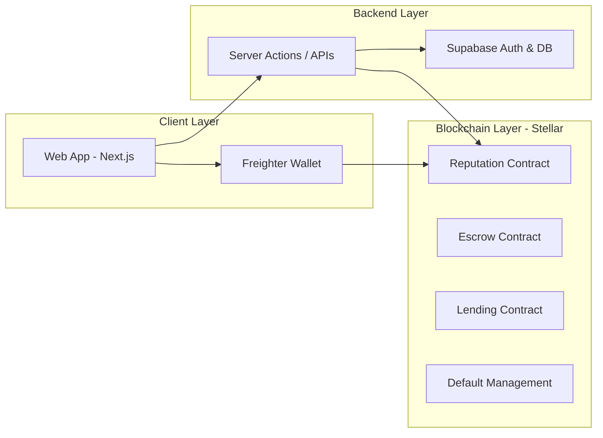

<p align="center">
  
</p>

<h1 align="center">TrustLend</h1>

<p align="center"><em>Reputation is your credit score. Earn trust, unlock capital, and build financial access.</em></p>

<p align="center">
   
   
   
   
   
   
   
</p>

<p align="center">✨ Fast. Transparent. Auditable. Global. ✨</p>

<p align="center">
  <strong><a href="https://trustlendborrow.vercel.app/">Live Production</a></strong> |
  <strong><a href="https://youtu.be/V-SQxunQLow">Video Demo</a></strong> |
  <strong><a href="ROADMAP.md">Roadmap</a></strong> |
  <strong><a href="CONTRIBUTING.md">Contributing Guidelines</a></strong>
</p>

---

## 🌍 About The Project

**TrustLend** is a decentralized micro-lending platform built on Stellar and Soroban. It bridges the gap between:
- **Borrowers** in emerging markets who need fast, collateral-free working capital.
- **Lenders** who want transparent yield with measurable social impact.

Traditional lending excludes millions who lack formal credit history or collateral. TrustLend solves this by utilizing **behavior-based on-chain reputation** and contract-enforced lending rules.

### 🏆 What Makes TrustLend Unique?
- **Behavior-Based Reputation:** Replaces legacy collateral-first lending with dynamic on-chain scoring.
- **Escrow-Assisted Disbursement:** Includes revocation window controls to protect lenders.
- **Default Management:** Mitigates risk via insurance-pool mechanics.
- **Gasless Fee Sponsorship:** Removes native XLM friction from user actions so borrowers aren't blocked by network fees.
- **End-to-End Traceability:** Complete transparency through on-chain contract events.

---

## 🚀 Vision: How TrustLend Can Evolve

TrustLend is designed as a foundational layer for decentralized, inclusive credit. As an open-source project, our vision for evolution includes:

1. **Decentralized Credit Oracles:** Evolving the reputation system to aggregate off-chain data (utility bills, mobile money history, Web2 integrations) via trusted oracles.
2. **Cross-Chain Liquidity:** Expanding lender pools to accept stablecoins across various ecosystems, routing them securely through Stellar's high-speed finality layer.
3. **DAO Governance:** Transitioning platform parameters (interest rates, insurance pool fees, slashing mechanics) to a community-governed DAO framework.
4. **Institutional Underwriting:** Enabling institutional liquidity providers to plug proprietary risk models into TrustLend's smart contracts to automatically fund specific borrower profiles.
5. **Global Fiat On/Off Ramps:** Deepening integration with Stellar anchors to allow seamless fiat borrowing and repayment in local currencies worldwide.

*We welcome open-source contributors to help us build this vision! Check out our [Roadmap](ROADMAP.md) for upcoming milestones.*

---

## 📸 Platform Sneak Peek

### Borrower & Lender Dashboards
<p align="center">
   
   
</p>

### Admin Controls & Verification
<p align="center">
   
   
</p>

---

## 🏗️ Architecture & Workflow

TrustLend uses a practical hybrid architecture: **fast UX off-chain** (Supabase/Next.js) combined with **trust-critical logic on-chain** (Soroban/Stellar).



### Core User Flow
1. **Onboarding:** User signs up, connects Freighter Wallet, and completes KYC.
2. **Borrowing:** Borrower requests a loan. The reputation contract verifies eligibility and limits based on past behavior.
3. **Lending:** Lender approves/funds the loan, locking funds into the Escrow Contract.
4. **Disbursement:** Following safety checks, funds are disbursed to the borrower.
5. **Repayment & Reputation:** On-time repayments boost the borrower's on-chain score. Defaults trigger the Default Management contract to utilize the insurance pool.

---

## 🛠️ Tech Stack

| Layer | Technology |
|---|---|
| **Frontend** | Next.js 16, React 19, TypeScript, Tailwind CSS 4, Framer Motion |
| **Backend & DB** | Supabase (Auth, Postgres RLS, Storage) |
| **Blockchain** | Stellar Testnet, Soroban RPC, Horizon API |
| **Wallet** | Freighter Wallet, `@stellar/freighter-api` |
| **Smart Contracts** | Rust (Soroban, `wasm32v1-none`) |

---

## ⚙️ Getting Started (Local Development)

### 1. Prerequisites
- Node.js 18+
- Rust toolchain & Stellar CLI
- Supabase (Cloud or Local CLI)

### 2. Installation
```bash
git clone https://github.com/thisisouvik/trustlend-stellar.git
cd trustlend-stellar
npm install
```

### 3. Environment Setup
```bash
cp .env.example .env.local
```
Fill in the required values in `.env.local` (Supabase credentials, Stellar testnet settings, and Contract IDs).

### 4. Database Setup
Run the SQL scripts located in `sql/` in your Supabase SQL editor:
1. `sql/001_schema.sql`
2. `sql/002_rls.sql`
3. `sql/KYC_SCHEMA.sql`

*(Note: Create a private storage bucket named `kyc-documents` for user uploads and apply RLS policies.)*

### 5. Run the App

**Option A: Standard Local Development**
```bash
npm run dev
```

**Option B: Using Docker Compose (Recommended)**
If you have Docker installed, you can skip local Node.js installation and run:
```bash
docker-compose up
```
The app will be available at `http://localhost:3000` with hot-reloading enabled.

---

<details>
<summary><b>🧩 Smart Contracts & Deployment Details (Click to Expand)</b></summary>
<br>

**Deployment Credentials:**
- Network: Stellar Testnet
- Admin Address: `GAJRNUO6HSMQG4FNHNWQVRXJZJZ7QRA7HXPYYB6H5PTA3EAAJXJNZD7U`
- Deployment Source Key Alias: `trustlend-admin`

**Contract Registry:**
| Contract | Env Key | Contract ID |
|---|---|---|
| Reputation | `NEXT_PUBLIC_REPUTATION_CONTRACT_ID` | `CD67XYZQ4DDARIXCYP77UR77BW3HWFCMLDHTQ7N6YUDML3NX246DD65G` |
| Escrow | `NEXT_PUBLIC_ESCROW_CONTRACT_ID` | `CABTPZ224ISV65LG5M47CPN3HV4QQKL452PQYWPCBKEQHFG4LSSCSYZO` |
| Lending | `NEXT_PUBLIC_LENDING_CONTRACT_ID` | `CCLVI2JGD7PUV75VHOLTUZF3CVXYBUTOSLKNLHEUUFXOY73BFXUEVEMO` |
| Default Management | `NEXT_PUBLIC_DEFAULT_CONTRACT_ID` | `CCEMBSRCFFRIZLEN54OQVVLSFJBV5QQ3OW5OIIG2BSA33VFJ3NHDYUKG` |

TrustLend utilizes the standard Soroban `Contract` class flow for integrations (`simulateTransaction`, `assembleTransaction`, etc.). Check `lib/stellar/soroban.ts` for reference.
</details>

---

## 🔔 Payment Due Webhook Scheduler

TrustLend includes an automated scheduler that checks for loans with payment deadlines approaching within **48 hours** and dispatches webhook notifications to a configured notification service.

### How It Works

1. An external scheduler (Vercel Cron or any HTTP trigger) calls `POST /api/cron/payment-due` hourly.
2. The route queries Supabase for `active` or `funded` loans with `due_at` between now and +48 hours.
3. A POST webhook is sent to `WEBHOOK_NOTIFICATION_URL` for each qualifying loan.
4. The loan's `metadata.payment_due_notified_at` is set to prevent duplicate notifications.
5. Per-loan errors are logged without stopping the rest of the batch.

### Required Environment Variables

| Variable | Description |
|---|---|
| `WEBHOOK_NOTIFICATION_URL` | URL of the notification service that receives payment-due webhook POSTs |
| `CRON_SECRET` | Secret token used to authenticate scheduler requests (`Authorization: Bearer <value>`) |
| `SUPABASE_SERVICE_ROLE_KEY` | Supabase service-role key (required for RLS-bypassing loan queries) |
| `RESEND_API_KEY` | Optional Resend API key for borrower email notifications |
| `RESEND_FROM_EMAIL` | Verified sender address used for TrustLend emails |
| `RESEND_REPLY_TO_EMAIL` | Optional reply-to address for support responses |

When Resend is configured, TrustLend sends borrower emails for loan approval,
loan funding, and overdue payments. Email failures are logged but do not roll
back successful loan state changes.

### Webhook Payload

```json
{
  "borrowerId": "uuid",
  "loanId": "uuid",
  "dueDate": "2026-07-01T12:00:00.000Z",
  "paymentAmount": 800.00
}
```

`paymentAmount` is `principal_amount − repaid_amount` (outstanding balance).

### Triggering the Scheduler

**Vercel Cron (automatic, hourly):** Configured in `vercel.json` — no additional setup needed.

**Manual trigger:**
```bash
curl -X POST https://your-app.vercel.app/api/cron/payment-due \
  -H "Authorization: Bearer $CRON_SECRET"
```

**Local development (no secret set):** The `Authorization` check is skipped when `CRON_SECRET` is not configured.

### Failure Handling

- Individual loan failures are logged and do not block other loans in the same run.
- The scheduler returns a JSON summary: `{ processed, succeeded, failed, errors }`.
- Webhook requests time out after 10 seconds.

---

## 🤝 Contributing

We love open-source contributors! Whether you're fixing bugs, improving documentation, or proposing new features, your help is welcome.

Please read our [Contributing Guidelines](CONTRIBUTING.md) and [Code of Conduct](CODE_OF_CONDUCT.md) before submitting a Pull Request.

---

## 🛡️ Security

If you discover a security vulnerability within TrustLend, please refer to our [Security Policy](SECURITY.md) for reporting instructions. Do **not** open a public issue for security-related matters.

---

## 📜 License

This project is licensed under the [MIT License](LICENSE).

---

<p align="center">Made with ❤️ by the TrustLend Community.</p>
