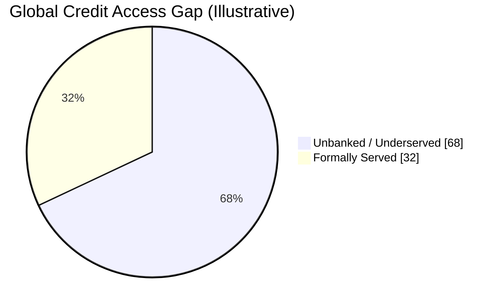
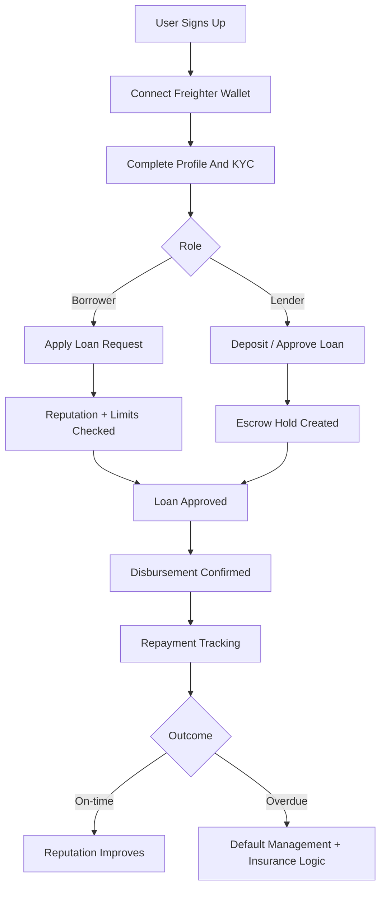
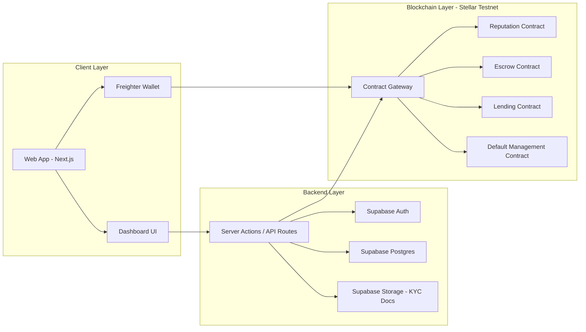

<p align="center">
  
</p>

<h1 align="center">TrustLend</h1>

<p align="center"><em>Reputation is your credit score. Earn trust, unlock capital, and build financial access.</em></p>

<p align="center">
   
   
   
   
   
   
</p>

<p align="center">✨ Fast. Transparent. Auditable. Global. ✨</p>

<p align="center"><strong>Live Production:</strong> <a href="https://trustlend-tau.vercel.app/">TrustLend Website</a></p>

<p align="center"><strong>Hosting:</strong> Deployed on Vercel</p>

## 🌍 About The Project

TrustLend is a decentralized micro-lending platform built on Stellar + Soroban that connects:

- Borrowers in emerging markets who need fast working capital
- Lenders who want transparent yield with measurable social impact

The platform combines on-chain reputation, lending, escrow, and default management with Supabase-powered authentication, profiles, and KYC workflows.

## 🧩 Problem We Are Solving

Traditional lending excludes millions of people because they do not have:

- Formal credit history
- Collateral
- Access to fast and fair banking rails

At the same time, capital providers have very limited transparent options to lend directly with auditable risk controls.

TrustLend solves this by using behavior-based on-chain reputation and contract-enforced lending rules.

## 📊 Impact Stats And Visuals

### 🚀 Snapshot Stats

| Metric | Value | Why It Matters |
|---|---:|---|
| Unbanked adults globally | 1.7B+ | Massive underserved borrower base |
| Typical savings APY | ~0.5% | Capital is underutilized |
| TrustLend target lender yield | 10% to 15% | Better risk-adjusted upside |
| Decision speed target | Minutes to hours | Faster than conventional underwriting |

### 📉 Capital Gap Distribution



## 🏆 What Is Unique In TrustLend

- Behavior-based reputation instead of legacy collateral-first lending
- Escrow-assisted disbursement with revocation window controls
- Default management with insurance-pool mechanics
- End-to-end traceability via on-chain contract events
- Practical hybrid architecture: fast UX off-chain, trust-critical logic on-chain

## 📸 Product Screenshots

### Landing


### Mobile Views

<p align="center">
   
   
</p>

### Borrower Dashboard


### Borrower Profile


### Lender Dashboard


### Lending Pool


### Admin Dashboard


## 🛠️ Tech Stack

| Layer | Technology |
|---|---|
| Frontend | Next.js 16, React 19, TypeScript, Tailwind CSS 4, Framer Motion |
| Auth + Database | Supabase Auth, PostgreSQL, Supabase Storage |
| Blockchain | Stellar Testnet, Soroban RPC, Horizon API |
| Wallet | Freighter Wallet, @stellar/freighter-api |
| Smart Contracts | Rust (Soroban), wasm32v1-none target |
| Tooling | ESLint 9, Node.js, Cargo, Stellar CLI |

## ✅ Feedback Compliance Update

The smart contract integration follows the standard Soroban `Contract` class pattern.

- Uses `new Contract(contractId)` with `contract.call(method, ...args)`
- Uses `simulateTransaction` and `assembleTransaction` from Soroban RPC
- Does not use low-level `invokeHostFunction` calls

Reference implementation:

- `lib/stellar/soroban.ts` (write and read helpers)

Deployment status:

- dApp is deployed on Vercel: https://trustlend-tau.vercel.app/

### Reviewer Quick Check

- Contract init (write flow): [lib/stellar/soroban.ts#L108](lib/stellar/soroban.ts#L108)
- Contract method call (write flow): [lib/stellar/soroban.ts#L114](lib/stellar/soroban.ts#L114)
- Simulation (write flow): [lib/stellar/soroban.ts#L119](lib/stellar/soroban.ts#L119)
- Assembled tx (write flow): [lib/stellar/soroban.ts#L125](lib/stellar/soroban.ts#L125)
- Contract init (read flow): [lib/stellar/soroban.ts#L179](lib/stellar/soroban.ts#L179)
- Contract method call (read flow): [lib/stellar/soroban.ts#L185](lib/stellar/soroban.ts#L185)
- Simulation (read flow): [lib/stellar/soroban.ts#L189](lib/stellar/soroban.ts#L189)

## ⛓️ Smart Contracts Deployed Details

> Environment keys are generated by contracts/scripts/deploy.sh and contracts/scripts/deploy.ps1.

### Deployment Credentials

| Credential Name | Value |
|---|---|
| Network | Stellar Testnet |
| Admin Address | `GAJRNUO6HSMQG4FNHNWQVRXJZJZ7QRA7HXPYYB6H5PTA3EAAJXJNZD7U` |
| Deployment Source Key Alias | `trustlend-admin` |

### Contract IDs And Verification Transactions

| Contract Name | Environment Variable | Contract ID | Verification Transaction Link |
|---|---|---|---|
| Borrower Reputation | `NEXT_PUBLIC_REPUTATION_CONTRACT_ID` | `CBPU62PW6LZFGZQPCETQ4YFNHBHWUN2BGNPHLJ5U2CYB6XPL7DAIC23X` | [View Transaction](https://stellar.expert/explorer/testnet/tx/f4cb6fdb4562cf5875cde9357ae4a67c8be001d5c9278cedcba7104dafc29a5f) |
| Escrow | `NEXT_PUBLIC_ESCROW_CONTRACT_ID` | `CAOSPG65ZSJAEZCYADGMKJGEM3TE6H3NXMSS3SDC2QAIATODJ54CCNTR` | [View Transaction](https://stellar.expert/explorer/testnet/tx/44cdaaafc748575ba17ae8677795f118ed672778bd675b5eda59ae2ff352ca71) |
| Lending | `NEXT_PUBLIC_LENDING_CONTRACT_ID` | `CCQZ5XJGSAGSP7OQJ2RFQLSMHVUXN6LWFAK6CEROHW7FRNA4JQOQHG7X` | [View Transaction](https://stellar.expert/explorer/testnet/tx/4171ac762bbd9254ca3a091c6f3725114c3f32810bc43bc9abde3b3d5cf9b9a7) |
| Default Management | `NEXT_PUBLIC_DEFAULT_CONTRACT_ID` | `CBCJRWJNZ7G5T7U7LG3YOENCF3IM3ZZSG2ZCTUJTL3FUWNPKC6A2T77W` | [View Transaction](https://stellar.expert/explorer/testnet/tx/5a3483b628da6abd0a63250f09fc982e764841552e7c6356936ab510b88d2e95) |

## 🗂️ Clean File Architecture

```text
trustlend/
|- app/                    # Next.js App Router pages, actions, APIs
|- components/             # Reusable UI and feature components
|- lib/                    # Business logic, contract clients, auth, utilities
|- contracts/              # Soroban Rust contracts + deployment scripts
|- sql/                    # Database schema and RLS SQL
|- docs/                   # Architecture, setup, and domain documentation
|- public/                 # Static assets (logo, screenshots, visuals)
|- types/                  # Shared TypeScript types
|- package.json            # Node project scripts and dependencies
|- next.config.ts          # Next.js runtime config
|- tsconfig.json           # TypeScript config
```

## 👤 User-Side Workflow



## 🏗️ Project Architecture Diagram



## ✨ Features (Tabular)

| Feature | Description | User Type |
|---|---|---|
| Reputation Profile | On-chain borrower profile and score controls | Borrower/Admin |
| Loan Request + Approval | Create, approve, and activate loan lifecycle | Borrower/Lender/Admin |
| Escrow Safety Window | Hold + revoke + confirm disbursement flow | Lender/Admin |
| Default Tracking | Loan overdue phase tracking and handling | Admin |
| Insurance Pool Events | Insurance funding and payout events | Admin/Lender |
| KYC Workflow | Document upload, review, approve/reject | User/Admin |
| Role-Based Dashboards | Admin, Borrower, and Lender dedicated workspaces | All |

## 📘 Contract Functions (Tabular)

| Contract | Read Functions | Write Functions |
|---|---|---|
| Reputation | has_profile, get_profile, calculate_max_loan, calculate_interest_rate, is_frozen | init_borrower, add_reputation_event, freeze_account, unfreeze_account |
| Escrow | get_hold, is_within_revocation_window, get_escrow_count | create_hold, revoke_hold, confirm_disbursement |
| Lending | get_loan, get_loan_count, is_overdue, days_overdue, get_payment_count, get_payment | create_loan_request, approve_loan, revoke_approval, activate_loan, record_payment, mark_defaulted |
| Default Management | get_default_record, get_insurance_balance, get_insurance_event_count, get_insurance_event | record_default, add_to_insurance, trigger_insurance_payout |

## 🚨 Blockchain Error Handling (Tabular)

| Scenario | Detection Point | Handling Strategy |
|---|---|---|
| Missing contract ID env | App startup / contract client init | Warn early and block contract calls until env is set |
| Wallet signature rejected | Freighter signing flow | Show actionable user feedback and keep transaction idempotent |
| Contract simulation failure | simulateContractCall | Display readable error and avoid submitting invalid tx |
| Disbursement race/revocation window conflict | Escrow + lending state checks | Enforce sequence: hold -> approve -> activate |
| Overdue/default state mismatch | Scheduled default tracking + read checks | Recompute overdue days and update default phase via admin path |
| RPC/Horizon transient error | Network call layer | Retry safe reads and surface degraded-state UI message |

## 🧪 Test Results And Evidence

### Contract Test Result


### End-to-End Test Result


**TypeScript + Lint:** `0 errors` - `npx tsc --noEmit` passes clean ✅  
**ESLint:** `0 errors` - `npm run lint` passes clean ✅

## ✅ Submission Verification Checklist

| Level | Criteria | Status |
|:---|:---|:---:|
| **Level 1** | Wallet connect / disconnect | ✅ |
| **Level 1** | Balance display | ✅ |
| **Level 1** | Send XLM transaction | ✅ |
| **Level 1** | Transaction feedback | ✅ |
| **Level 1** | 3+ error types handled | ✅ |
| **Level 2** | Smart contracts deployed on Testnet | ✅ |
| **Level 2** | Contract calls working (Reputation, Escrow, Lending, Default) | ✅ |
| **Level 2** | Multi-wallet support (Freighter) | ✅ |
| **Level 2** | Real-time on-chain status | ✅ |
| **Level 3** | Inter-contract calls (Reputation → Lending) | ✅ |
| **Level 3** | 20+ tests passing | ✅ |
| **Level 3** | Mobile responsive | ✅ |
| **Level 3** | CI/CD running (GitHub Actions) | ✅ |
| **Submission** | Complete README with architecture | ✅ |
| **Submission** | Contract addresses documented with Tx links | ✅ |

## ⚙️ Setup Guide (Env, Contracts, Supabase, Full Project)

### 1) Prerequisites

- Node.js 18+
- Rust toolchain
- Stellar CLI
- Supabase project (cloud or local)

### 2) Install Dependencies

```bash
npm install
```

### 3) Configure Environment

```bash
cp .env.example .env.local
```

Fill required values in `.env.local`:

- Supabase URL and anon key
- `NEXT_PUBLIC_SITE_URL`
- Stellar testnet settings
- Soroban RPC URL
- Contract IDs:
  - `NEXT_PUBLIC_REPUTATION_CONTRACT_ID=CBPU62PW6LZFGZQPCETQ4YFNHBHWUN2BGNPHLJ5U2CYB6XPL7DAIC23X`
  - `NEXT_PUBLIC_ESCROW_CONTRACT_ID=CAOSPG65ZSJAEZCYADGMKJGEM3TE6H3NXMSS3SDC2QAIATODJ54CCNTR`
  - `NEXT_PUBLIC_LENDING_CONTRACT_ID=CCQZ5XJGSAGSP7OQJ2RFQLSMHVUXN6LWFAK6CEROHW7FRNA4JQOQHG7X`
  - `NEXT_PUBLIC_DEFAULT_CONTRACT_ID=CBCJRWJNZ7G5T7U7LG3YOENCF3IM3ZZSG2ZCTUJTL3FUWNPKC6A2T77W`
- Admin Stellar address (`GAJRNUO6HSMQG4FNHNWQVRXJZJZ7QRA7HXPYYB6H5PTA3EAAJXJNZD7U`)

### 4) Setup Supabase Database And RLS

Run SQL in Supabase SQL editor:

1. `sql/001_schema.sql`
2. `sql/002_rls.sql`
3. `sql/KYC_SCHEMA.sql`

Then create Storage bucket:

- Bucket name: `kyc-documents`
- Visibility: Private

Add required storage RLS policies for upload/read/admin review as documented in `docs/KYC_SETUP.md`.

### 5) Build And Deploy Smart Contracts (Stellar Testnet)

From project root:

```bash
cd contracts
stellar contract build
```

Run deployment script:

On Linux/macOS:

```bash
./scripts/deploy.sh
```

On Windows PowerShell:

```powershell
.\scripts\deploy.ps1
```

After deployment:

- Copy values from `.env.contracts` into `.env.local`
- Ensure all `NEXT_PUBLIC_*_CONTRACT_ID` values are set

### 6) Start Application

```bash
npm run dev
```

Open `http://localhost:3000`.


Smart contract tests:

```bash
cd contracts
cargo test
```

Frontend lint check:

```bash
npm run lint
```
<br>
<i>Thank you for checking out TrustLend.
Love doing this project.</i>