<div align="center">
  
</div>

<div align="center">


[](https://nextjs.org)
[](https://react.dev)
[](https://www.typescriptlang.org)
[](https://supabase.com)
[](https://stellar.org)
[](https://soroban.stellar.org)

**Reputation-driven micro-lending with role-based workflows, on-chain contract integration, and auditable off-chain operations.**

**Live App:** https://trustlendborrow.vercel.app/

**Project Overview Documentation:** [View in Google Docs](https://docs.google.com/document/d/1bnVoG9n4WajP-05TWVWZhFh036hFgK5KwmklnX8762I/edit?usp=sharing)

## Demo Video : [Youtube Video Link](https://youtu.be/V-SQxunQLow)

</div>

---

# Table of Contents

<details>
<summary>System Architecture</summary>

- [System Architecture Overview](#system-architecture-overview)
- [Platform Interface Gallery](#-platform-interface-gallery-compact)
- [Technology Stack](#technology-stack)

</details>

<details>
<summary>Core Components</summary>

- [Web Application](#web-application)
- [Role Dashboards](#role-dashboards)
- [API Layer](#api-layer)
- [Smart Contracts](#smart-contracts)

</details>

<details>
<summary>Blockchain & Data Layer</summary>

- [Soroban Integration Pattern](#soroban-integration-pattern)
- [Supabase Data & RLS](#supabase-data--rls)

</details>

<details>
<summary>Installation & Setup</summary>

- [Prerequisites](#prerequisites)
- [Step-by-Step Installation](#step-by-step-installation)
- [Environment Configuration](#environment-configuration)
- [Database Migration Order](#database-migration-order)

</details>

<details>
<summary>API Reference</summary>

- [Core Backend Endpoints](#core-backend-endpoints)
- [Role Guard Behavior](#role-guard-behavior)
- [WebSocket Events](#websocket-events)

</details>

<details>
<summary>Performance & Security</summary>

- [Performance Notes](#performance-notes)
- [Security & Privacy](#security--privacy)

</details>

<details>
<summary>Development</summary>

- [Development Setup](#development-setup)
- [Project Structure](#project-structure)
- [Testing Workflow](#testing-workflow)
- [Troubleshooting](#troubleshooting)

</details>

<details>
<summary>Feedback & Judges</summary>

- [Feedback Form](#feedback--judges)

</details>

<details>
<summary>Future Roadmap</summary>

- [Future Roadmap](#future-roadmap)

</details>

<details>
<summary>License & Acknowledgments</summary>

- [License](#license)
- [Acknowledgments](#acknowledgments)

</details>

---

## Feedback & Judges

- Feedback Form: https://forms.gle/HikhmMvWXZLgcrEM8
- Responses Sheet (For Judges): https://docs.google.com/spreadsheets/d/168QC8eCrS6rfZeSRwYctr6XH38dLQwsK9YmIzpOryXo/edit?usp=sharing

---

## System Architecture Overview

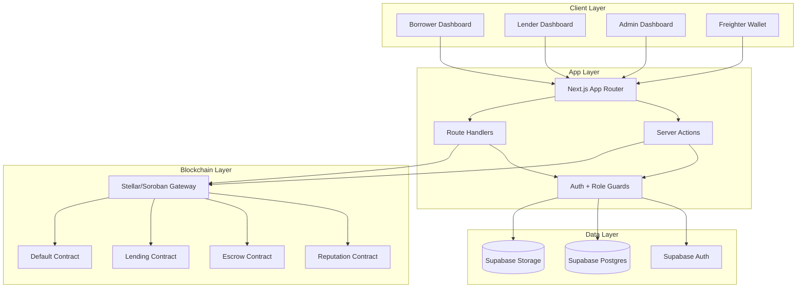

---

## 📸 Platform Interface Gallery (Compact)

### 1) Auth & Main Landing
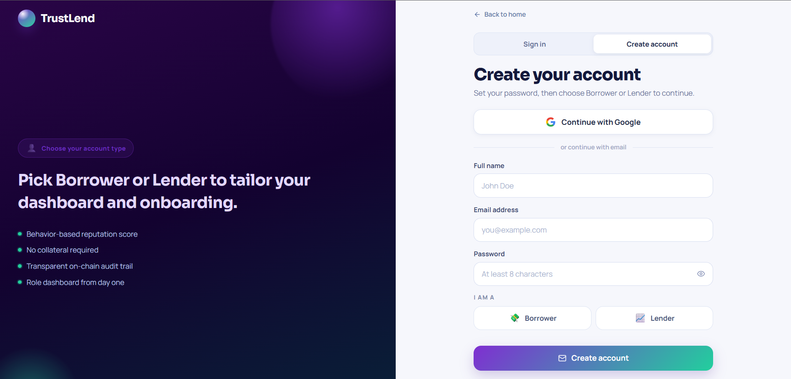
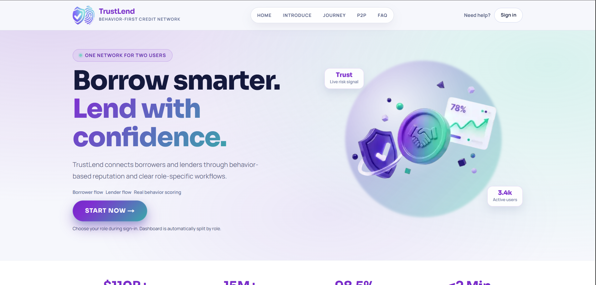

### 2) Borrower Workflows
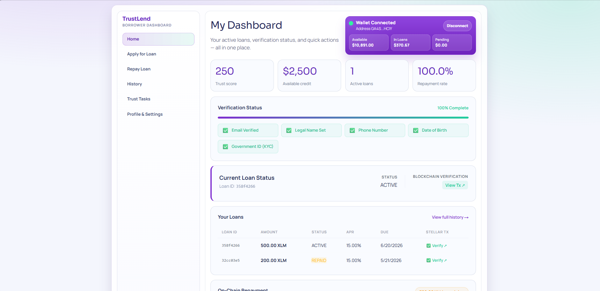
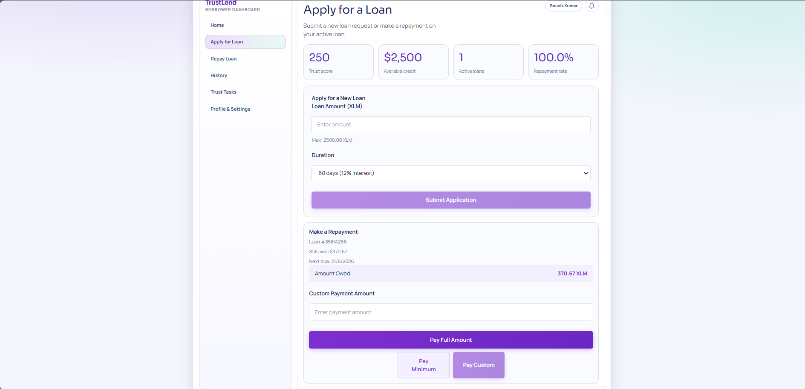
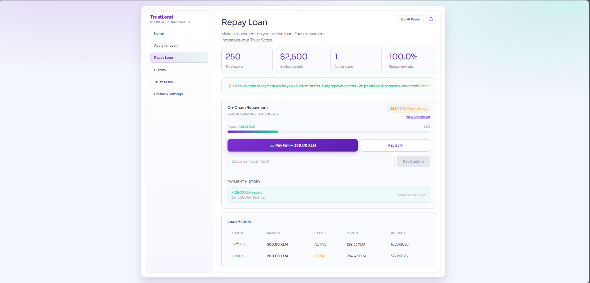
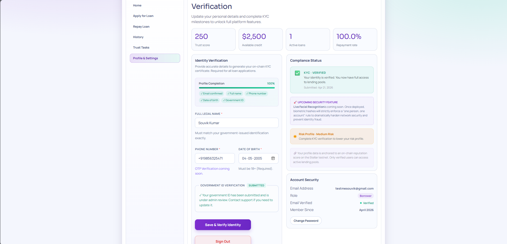
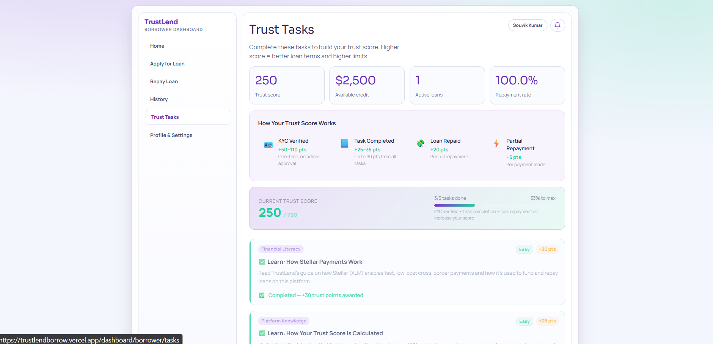

### 3) Lender Workflows
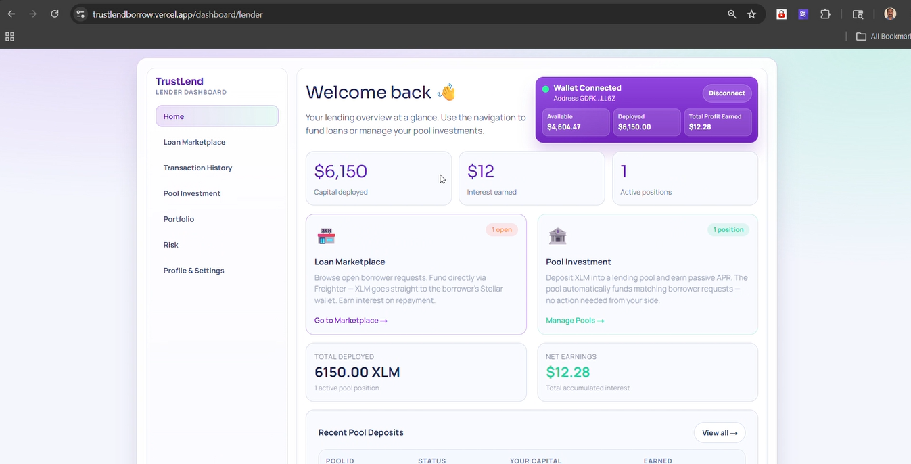
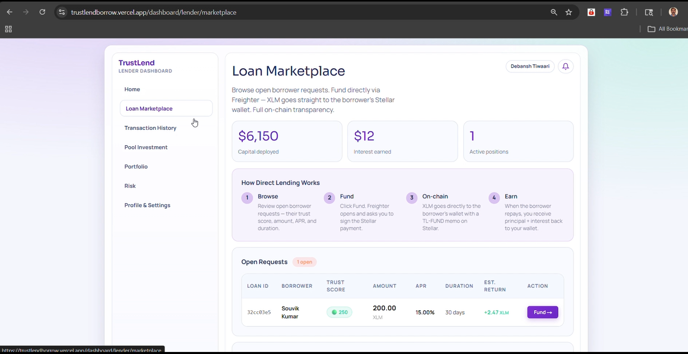
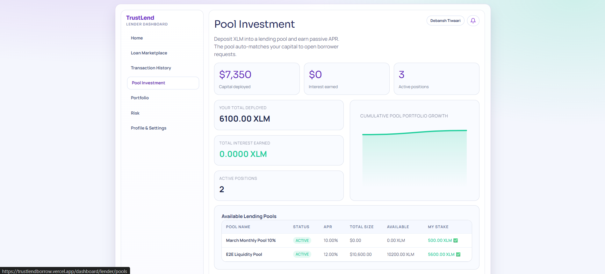
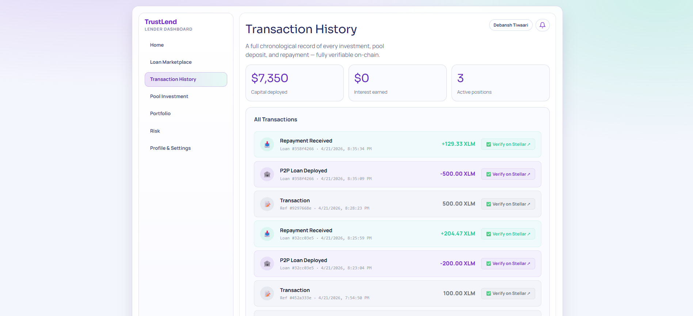

### 4) Admin Treasury


### 5) Workflow & Contracts Testing
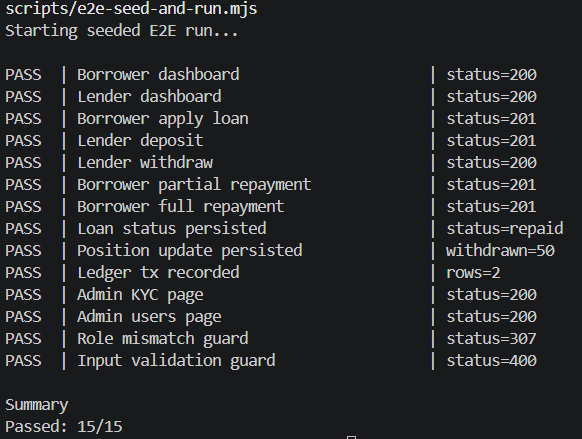
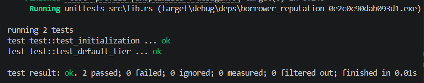

---

## Technology Stack

### Core Technologies

| Component | Technology | Version | Purpose |
|-----------|------------|---------|---------|
| Frontend | Next.js + React + TypeScript | Next 16.2.3, React 19.2.4, TS 5 | Web app and role dashboards |
| Backend | Next.js Route Handlers + Server Actions | App Router | API workflows and business logic |
| Auth & DB | Supabase Auth + PostgreSQL | @supabase/supabase-js 2.103.0 | Authentication, persistence, RLS |
| Storage | Supabase Storage | Supabase | KYC document handling |
| Blockchain Client | @stellar/stellar-sdk + @stellar/freighter-api | 15.0.1, 6.0.1 | Stellar tx and wallet integration |
| Smart Contracts | Soroban Rust contracts | Rust/Cargo | Reputation, lending, escrow, defaults |
| Styling/UI | Tailwind CSS + Framer Motion | Tailwind 4, Framer Motion 12.38.0 | Dashboard UI/animations |
| Tooling | ESLint + TypeScript + Node.js | ESLint 9 | Build quality and lint checks |


## Web Application

TrustLend is a role-based micro-lending platform with:

- Borrower workflow: profile completion, KYC upload, loan apply, repayment.
- Lender workflow: pool deposit, withdraw, portfolio tracking.
- Admin workflow: user oversight, KYC review, pool/loan controls.
- Contract-aware operations with Stellar testnet addresses and Soroban calls.

## Role Dashboards

### Borrower

- Dashboard: loan status, trust/reputation context, actions.
- Profile page: legal details and KYC submission.
- Loans/repay pages: apply and repay lifecycle.

### Lender

- Dashboard: pool opportunities and positions.
- Pools/portfolio/risk pages for deposit and performance tracking.

### Admin

- Overview, users, KYC, loans, pools, security, and activity pages.
- Access guarded by allowlist + DB admin role checks.

## API Layer

Route handlers under `app/api` power:

- Loan apply/fund/repay flows.
- Pool deposit/withdraw flows.
- Notification and task actions.

These APIs enforce role checks and input validation before DB/contract operations.

## Smart Contracts

The project uses four deployed Soroban contracts on Stellar testnet:

| Contract | Env Key | Contract ID | Verification Tx |
|---|---|---|---|
| Borrower Reputation | `NEXT_PUBLIC_REPUTATION_CONTRACT_ID` | `CD67XYZQ4DDARIXCYP77UR77BW3HWFCMLDHTQ7N6YUDML3NX246DD65G` | [View](https://stellar.expert/explorer/testnet/tx/aef2c3613aa9e99dc72e8427c446b4464c6b4dd44e82e29a78da42deb2fe0e38) |
| Escrow | `NEXT_PUBLIC_ESCROW_CONTRACT_ID` | `CABTPZ224ISV65LG5M47CPN3HV4QQKL452PQYWPCBKEQHFG4LSSCSYZO` | [View](https://stellar.expert/explorer/testnet/tx/50b8571b7e5a5eeca1b4948093dcf7f8c8107242302406c90e23d430621bdc7b) |
| Lending | `NEXT_PUBLIC_LENDING_CONTRACT_ID` | `CCLVI2JGD7PUV75VHOLTUZF3CVXYBUTOSLKNLHEUUFXOY73BFXUEVEMO` | [View](https://stellar.expert/explorer/testnet/tx/60958b7375f63c9aac29c30bf0ff63d800db7be9085bb26a3266af4e12dbbde5) |
| Default Management | `NEXT_PUBLIC_DEFAULT_CONTRACT_ID` | `CCEMBSRCFFRIZLEN54OQVVLSFJBV5QQ3OW5OIIG2BSA33VFJ3NHDYUKG` | [View](https://stellar.expert/explorer/testnet/tx/69f61a1e8cc59f12f2d012ccd8347bc49ec29f7d89bb4a4107fcd85d7252c928) |


### Deployment credentials:

| Field | Value |
|---|---|
| Network | Stellar Testnet |
| Admin Address | `GCEDSYKBVHK63J5OOYKDBYYHLG2BZNJN74B6PJVFYXS4HR7QOPQBYECG` |
| Source Key Alias | `trustlend-admin` |

---

## Soroban Integration Pattern

TrustLend uses the standard Soroban `Contract` class flow (not low-level host calls):

- `new Contract(contractId)`
- `contract.call(method, ...args)`
- `simulateTransaction(...)`
- `assembleTransaction(...)`

Reviewer references:

- [lib/stellar/soroban.ts#L108](lib/stellar/soroban.ts#L108)
- [lib/stellar/soroban.ts#L114](lib/stellar/soroban.ts#L114)
- [lib/stellar/soroban.ts#L119](lib/stellar/soroban.ts#L119)
- [lib/stellar/soroban.ts#L125](lib/stellar/soroban.ts#L125)
- [lib/stellar/soroban.ts#L179](lib/stellar/soroban.ts#L179)
- [lib/stellar/soroban.ts#L185](lib/stellar/soroban.ts#L185)
- [lib/stellar/soroban.ts#L189](lib/stellar/soroban.ts#L189)

## Supabase Data & RLS

- Authenticated session clients are used for normal user actions.
- Admin pages/actions run through authenticated admin session + RLS policies.
- MVP hardening includes profile privilege-escalation protection via SQL migration.

---

## Prerequisites

- Node.js 18+
- Rust toolchain + Cargo (for contract builds)
- Stellar CLI
- Supabase project

## Step-by-Step Installation

```bash
npm install
cp .env.example .env.local
npm run dev
```

Open: `http://localhost:3000`

## Environment Configuration

Set production variables from `.env.example`.

Required values include:

- Supabase URL and anon key
- Soroban RPC URL
- Admin allowlist emails
- Admin address
- Four deployed contract IDs


## Database Migration Order

Run in Supabase SQL editor in this exact order:

1. `sql/01_core_schema.sql`
2. `sql/02_security_rls.sql`
3. `sql/03_functions_rpcs.sql`

---

## Core Backend Endpoints

| Endpoint | Method | Purpose |
|---|---|---|
| `/api/loans/apply` | POST | Borrower loan request |
| `/api/loans/fund` | POST | Lender funds approved/requested loan |
| `/api/loans/repay` | POST | Borrower repayment write path |
| `/api/loans/repay/preflight` | GET | Repayment breakdown + destination context |
| `/api/pools/deposit` | POST | Lender pool deposit |
| `/api/pools/withdraw` | POST | Lender pool withdrawal |
| `/api/notifications` | GET | User notifications |
| `/api/notifications/clear` | POST | Clear notifications |
| `/api/tasks/complete` | POST | Task completion + reputation event |

## Role Guard Behavior

| Scenario | Expected |
|---|---|
| Borrower valid loan apply | `201` |
| Borrower invalid amount | `400` |
| Lender valid deposit | `201` |
| Lender valid withdraw | `200` |
| Role mismatch to protected route | Redirect/guard behavior (`307`) |


## Performance Notes

- Built with Next.js 16 and Turbopack-ready workflow.
- App Router pages are split across role-specific routes.
- Lint and production build validation are integrated in the workflow.

## Security & Privacy

- Admin access: allowlist email + DB admin role required.
- Profile update path protected with RLS constraints against self role escalation.
- KYC files managed in Supabase Storage with controlled access.
- Production guidance: no dev bypass variables and no local env file deployment.

---

## Development Setup

```bash
npm install
npm run dev
```

Build and validate:

```bash
npm run build
npm run lint
npm run e2e:seed
```

## Project Structure

```text
trustlend/
|- app/                    # App Router pages, API routes, actions
|- components/             # UI, dashboard, auth, landing components
|- contracts/              # Soroban contracts + deployment scripts
|- lib/                    # Auth, Supabase, Stellar, and contract helpers
|- public/                 # Static assets and images
|- sql/                    # Schema and RLS migrations
|- types/                  # Shared TypeScript types
|- package.json            # Scripts and dependencies
|- next.config.ts          # Next.js config
|- tsconfig.json           # TypeScript config
```

## Testing Workflow

- Manual role-based validation: borrower, lender, admin.
- Seeded end-to-end command: `npm run e2e:seed`

## Troubleshooting

- If admin pages redirect: verify allowlist + admin role in `profiles`.
- If lender actions fail: verify active pools and liquidity.
- If repayments fail: verify loan state and payload validation.
- If deployment fails: verify migration order and env variables.

---

## Future Roadmap

This next phase is prioritized from collected user feedback around identity trust, role flexibility, onboarding clarity, and safer lending operations.


### Feedback-Driven Plan

| Feedback Theme | What We Will Improve | Planned Evolution |
|---|---|---|
| Identity trust before funding | Add live face verification in the UI to match each KYC submission before account activation. | Lower fraud risk and stronger lender confidence in borrower identity. |
| Need one account for both roles | Enable one verified account to operate as borrower, lender, or both with safe role-switching controls. | Better retention and smoother growth from borrower to lender journeys. |
| Security expectations for production readiness | Harden access control, transaction validation, audit logs, and abuse/rate-limiting defenses. | Stronger platform integrity for larger pools and higher transaction volume. |
| Dedicated admin dashboard evolution | Build a more advanced admin workspace for risk monitoring, fraud alerts, manual review queues, and policy controls. | Faster operational response, better governance, and safer platform-wide decisions. |
| Stronger repayment security for lender protection | Add repayment safeguards such as preflight validation, stricter repayment checks, repayment monitoring, and recovery/default workflows. | Higher lender fund safety, lower repayment risk, and improved trust in long-term lending. |
| New users need guided onboarding | Add beginner-friendly guided tasks, checklists, and contextual status hints across dashboards. | Faster activation, fewer drop-offs, and clearer first-time user experience. |
| Better decision support | Expand risk scoring, lender analytics, and smarter pool matching automation. | Improved loan quality, clearer lender insights, and healthier pool utilization. |

### Delivery Sequence (Next Phase)

1. Identity + face verification rollout with KYC binding.
2. Unified dual-role account model (borrower/lender switching).
3. Security hardening sprint across auth, APIs, and contract interactions.
4. Dedicated admin dashboard upgrade with fraud/risk operations tooling.
5. Repayment security hardening to better protect lender capital.
6. Guided task UX for first-time users.
7. Advanced analytics and pool automation improvements.

---

## License

MIT (project-level license policy).

## Acknowledgments

- Stellar + Soroban ecosystem
- Supabase platform
- Next.js and React ecosystems
- Open-source Rust and TypeScript communities

---

Done with ❤️ by Souvik. We look forward to your feedback and questions!
