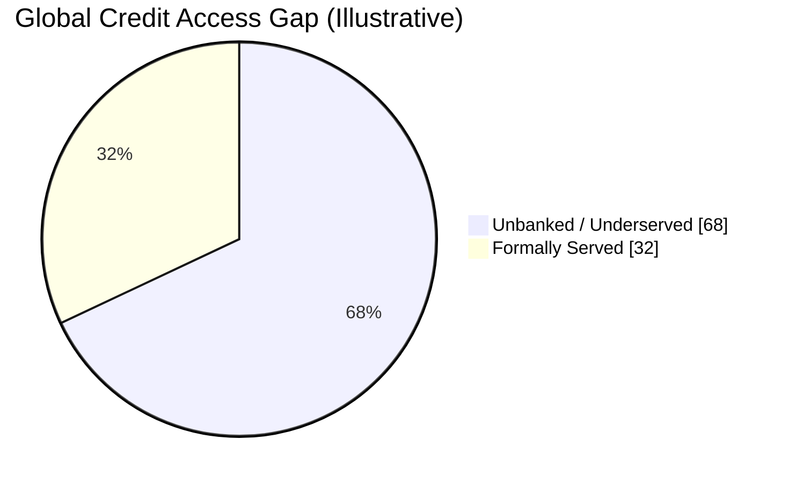
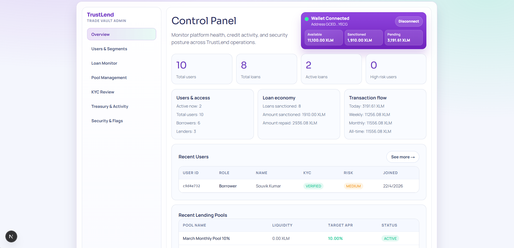
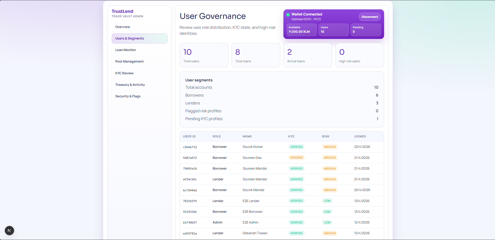
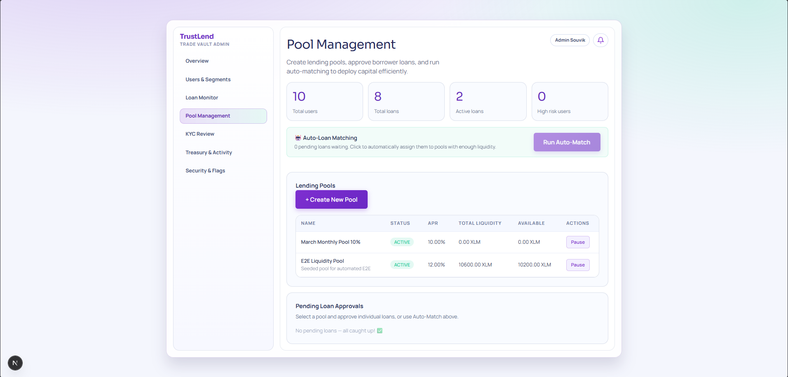
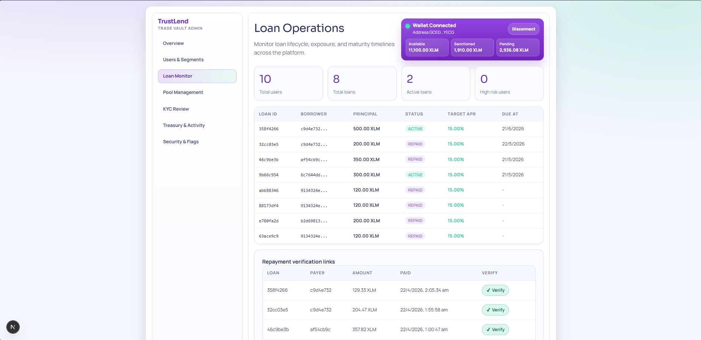
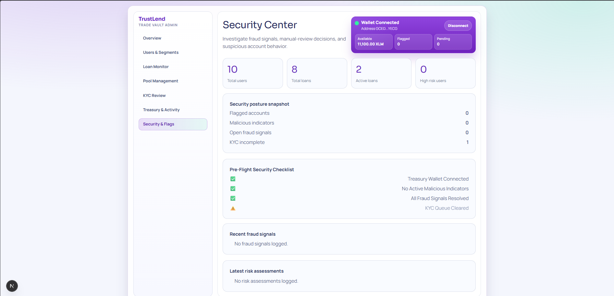
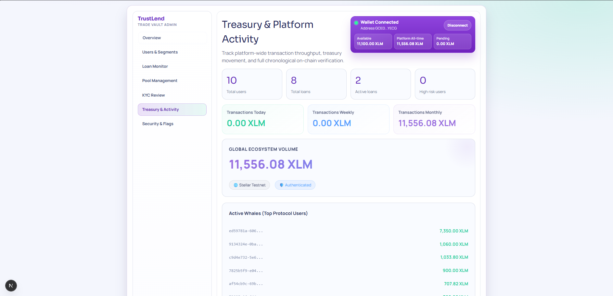
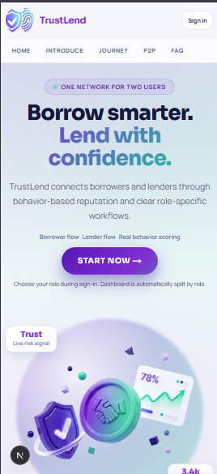
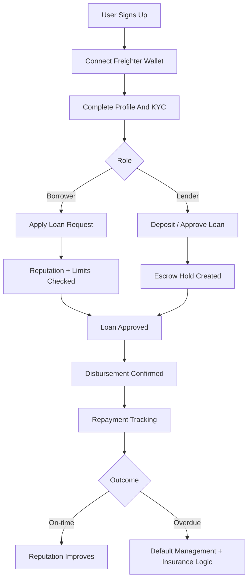
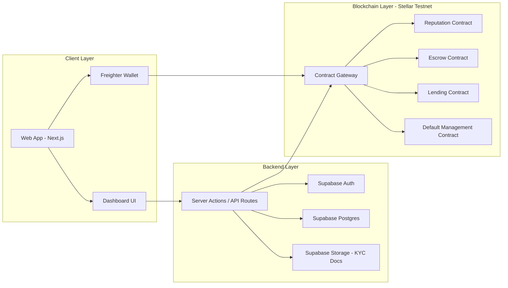

<p align="center">
  
</p>

<h1 align="center">TrustLend</h1>

<p align="center"><em>Reputation is your credit score. Earn trust, unlock capital, and build financial access.</em></p>

<p align="center">
   
   
   
   
   
   
</p>

<p align="center">✨ Fast. Transparent. Auditable. Global. ✨</p>

<p align="center"><strong>Live Production:</strong> <a href="https://trustlendborrow.vercel.app/">TrustLend Website</a></p>

<p align="center"><strong>Youtube Video:</strong> <a href="https://youtu.be/V-SQxunQLow">TrustLend Demo</a></p>

<p align="center"><strong>Community Contribution:</strong> <a href="https://x.com/souvik_io/status/2049884654191427888">X Post link</a></p>

## 🌍 About The Project

TrustLend is a decentralized micro-lending platform built on Stellar + Soroban that connects:

- Borrowers in emerging markets who need fast working capital
- Lenders who want transparent yield with measurable social impact

The platform combines on-chain reputation, lending, escrow, and default management with Supabase-powered authentication, profiles, and KYC workflows.

## 🧩 Problem We Are Solving

Traditional lending excludes millions of people because they do not have:

- Formal credit history
- Collateral
- Access to fast and fair banking rails

At the same time, capital providers have very limited transparent options to lend directly with auditable risk controls.

TrustLend solves this by using behavior-based on-chain reputation and contract-enforced lending rules.

## 📊 Impact Stats And Visuals

### 🚀 Snapshot Stats

| Metric | Value | Why It Matters |
|---|---:|---|
| Unbanked adults globally | 1.7B+ | Massive underserved borrower base |
| Typical savings APY | ~0.5% | Capital is underutilized |
| TrustLend target lender yield | 10% to 15% | Better risk-adjusted upside |
| Decision speed target | Minutes to hours | Faster than conventional underwriting |

### 📉 Capital Gap Distribution



## 🏆 What Is Unique In TrustLend

- Behavior-based reputation instead of legacy collateral-first lending
- Escrow-assisted disbursement with revocation window controls
- Default management with insurance-pool mechanics
- End-to-end traceability via on-chain contract events
- Practical hybrid architecture: fast UX off-chain, trust-critical logic on-chain

### Table 1: User Onboarding List

| User Name | User Email | User Wallet Address | User Type |
|-----------|-----------|-------------------|-----------|
| Souvik Mandal | souvikmandals10@gmail.com | GAG3SUKHIF7VAWGTDRH52XETMLZXXNXBAZLLXHSLXAQPOBBCN43YLKR4 | Borrower |
| Saurav Suman | sauravsumanjnvm9@gmail.com | GAKJ6VMQSJQ7S55YNQUSBVETOTANGE3NTG4CHTW3IPOEAT7SXG6UZEWB | Lender |
| Soumen Mandal | prosoumen27@gmail.com | GCJWSEXMUW3B2SHKMAGKQ5ZD56V2YHHTRGYETS3WV2IN3ISXKVRWLSP7 | Borrower |
| Subham Singha | subhamsingha220706@gmail.com | GDFKLTB5WKKDDJ2NRU2V5OG476HYEGWT4UFV7BID7BNGWZGRZYL3LL6Z | Lender |
| Pritam Dey | deypritam201@gmail.com | GA4SXARZZ4RPF6N7VOAH3B5OKMFAP3FGY6M6TO3DZJL4TMU2KOVBHCIY | Borrower |

### Table 2: User Feedback & Implementation

| User Name | User Email | User Wallet Address | User Feedback | Overall Rating | NPS Score | Commit ID |
|-----------|-----------|-------------------|---------------|---------|-----------|-----------|
| Souvik Mandal | souvikmandals10@gmail.com | GAG3SUKHIF7VAWGTDRH52XETMLZXXNXBAZLLXHSLXAQPOBBCN43YLKR4 | KYC flow needs stronger validation and scam prevention before borrowers are approved. | 5/5 | 9/10 | [daa8141](../../commit/daa8141) |
| Saurav Suman | sauravsumanjnvm9@gmail.com | GAKJ6VMQSJQ7S55YNQUSBVETOTANGE3NTG4CHTW3IPOEAT7SXG6UZEWB | Pool investment experience would feel safer with clearer lender protection and balance safeguards. | 4/5 | 8/10 | [899efd2](../../commit/899efd2) |
| Soumen Mandal | prosoumen27@gmail.com | GCJWSEXMUW3B2SHKMAGKQ5ZD56V2YHHTRGYETS3WV2IN3ISXKVRWLSP7 | The borrower journey feels stable now, but clearer role and status checks would help first-time users. | 4/5 | 8/10 | [c5d5541](../../commit/c5d5541) |
| Subham Singha | subhamsingha220706@gmail.com | GDFKLTB5WKKDDJ2NRU2V5OG476HYEGWT4UFV7BID7BNGWZGRZYL3LL6Z | Admin-side visibility for KYC, security flags, and user control should be stronger for trust. | 4/5 | 7/10 | [ddcc01a](../../commit/ddcc01a) |
| Pritam Dey | deypritam201@gmail.com | GA4SXARZZ4RPF6N7VOAH3B5OKMFAP3FGY6M6TO3DZJL4TMU2KOVBHCIY | Gasless fee sponsorship is a strong improvement because it removes wallet friction for users. | 5/5 | 9/10 | [fb17e55](../../commit/fb17e55) |

## ⚒️ Advanced Feature Details: Fee Sponsorship

Fee Sponsorship is the advanced feature used to remove native XLM friction from user actions. For a micro-lending product, this matters because a borrower may be fully verified and ready to act without holding tokens for network fees.

| Aspect | How it is implemented here | Impact on the project |
|---|---|---|
| API entry point | The `/api/sponsor` route accepts a client-signed XDR transaction and handles sponsorship on the server. | Users can complete on-chain actions with less wallet friction. |
| Fee-bump flow | The route extracts the inner transaction, wraps it in a Stellar `FeeBumpTransaction`, and signs it with the platform treasury key. | The app keeps the gas payment responsibility on the platform instead of the user. |
| Network safety | Network configuration and treasury signing stay server-side in `app/api/sponsor/route.ts`. | Sensitive signing logic is not exposed to the client. |
| Product value | The flow supports borrowers who need access first and cannot be blocked by network-fee setup. | Better onboarding, fewer drop-offs, and a smoother lending experience. |

## ⚙️ Security

TrustLend protects sensitive lending workflows with role checks, Supabase RLS, and contract-side validation so borrower, lender, and admin actions stay constrained to the right paths.

Security evidence: [Sucuri SiteCheck Proof](https://sitecheck.sucuri.net/results/https/trustlendborrow.vercel.app)

## 📸 Product Screenshots

### Borrower Screenshots

| Feature | Screenshot |
|---|---|
| Home / overview |  |
| Apply loan |  |
| Repayment |  |
| Tasks |  |
| Profile |  |

### Lender Screenshots

| Feature | Screenshot |
|---|---|
| Home |  |
| Marketplace |  |
| Pool investment |  |
| History |  |

### Admin Screenshots

| Feature | Screenshot |
|---|---|
| Overview |  |
| Users & segments |  |
| KYC verification |  |
| Pool management |  |
| Loan monitoring |  |
| Security flags |  |
| Treasury |  |

### Mobile Views

<p align="center">
   
   
</p>

## 🛠️ Tech Stack

| Layer | Technology |
|---|---|
| Frontend | Next.js 16, React 19, TypeScript, Tailwind CSS 4, Framer Motion |
| Auth + Database | Supabase Auth, PostgreSQL, Supabase Storage |
| Blockchain | Stellar Testnet, Soroban RPC, Horizon API |
| Wallet | Freighter Wallet, @stellar/freighter-api |
| Smart Contracts | Rust (Soroban), wasm32v1-none target |
| Tooling | ESLint 9, Node.js, Cargo, Stellar CLI |

## ⛓️ Smart Contracts Deployed Details

> Environment keys are generated by contracts/scripts/deploy.sh and contracts/scripts/deploy.ps1.

### Deployment Credentials

| Credential Name | Value |
|---|---|
| Network | Stellar Testnet |
| Admin Address | `GAJRNUO6HSMQG4FNHNWQVRXJZJZ7QRA7HXPYYB6H5PTA3EAAJXJNZD7U` |
| Deployment Source Key Alias | `trustlend-admin` |

## 🧩 Contract Registry

| Contract | Env Key | Contract ID | Verification Tx |
|---|---|---|---|
| Borrower Reputation | `NEXT_PUBLIC_REPUTATION_CONTRACT_ID` | `CD67XYZQ4DDARIXCYP77UR77BW3HWFCMLDHTQ7N6YUDML3NX246DD65G` | [View](https://stellar.expert/explorer/testnet/tx/aef2c3613aa9e99dc72e8427c446b4464c6b4dd44e82e29a78da42deb2fe0e38) |
| Escrow | `NEXT_PUBLIC_ESCROW_CONTRACT_ID` | `CABTPZ224ISV65LG5M47CPN3HV4QQKL452PQYWPCBKEQHFG4LSSCSYZO` | [View](https://stellar.expert/explorer/testnet/tx/50b8571b7e5a5eeca1b4948093dcf7f8c8107242302406c90e23d430621bdc7b) |
| Lending | `NEXT_PUBLIC_LENDING_CONTRACT_ID` | `CCLVI2JGD7PUV75VHOLTUZF3CVXYBUTOSLKNLHEUUFXOY73BFXUEVEMO` | [View](https://stellar.expert/explorer/testnet/tx/60958b7375f63c9aac29c30bf0ff63d800db7be9085bb26a3266af4e12dbbde5) |
| Default Management | `NEXT_PUBLIC_DEFAULT_CONTRACT_ID` | `CCEMBSRCFFRIZLEN54OQVVLSFJBV5QQ3OW5OIIG2BSA33VFJ3NHDYUKG` | [View](https://stellar.expert/explorer/testnet/tx/69f61a1e8cc59f12f2d012ccd8347bc49ec29f7d89bb4a4107fcd85d7252c928) |

### 🌐 Deployment credentials:

| Field | Value |
|---|---|
| Network | Stellar Testnet |
| Admin Address | `GCEDSYKBVHK63J5OOYKDBYYHLG2BZNJN74B6PJVFYXS4HR7QOPQBYECG` |
| Source Key Alias | `trustlend-admin` |

---

## Soroban Integration Pattern

TrustLend uses the standard Soroban `Contract` class flow (not low-level host calls):

- `new Contract(contractId)`
- `contract.call(method, ...args)`
- `simulateTransaction(...)`
- `assembleTransaction(...)`

Reviewer references:

- [lib/stellar/soroban.ts#L108](lib/stellar/soroban.ts#L108)
- [lib/stellar/soroban.ts#L114](lib/stellar/soroban.ts#L114)
- [lib/stellar/soroban.ts#L119](lib/stellar/soroban.ts#L119)
- [lib/stellar/soroban.ts#L125](lib/stellar/soroban.ts#L125)
- [lib/stellar/soroban.ts#L179](lib/stellar/soroban.ts#L179)
- [lib/stellar/soroban.ts#L185](lib/stellar/soroban.ts#L185)
- [lib/stellar/soroban.ts#L189](lib/stellar/soroban.ts#L189)


## 🗂️ Clean File Architecture

```text
trustlend/
|- app/                    # Next.js App Router pages, actions, APIs
|- components/             # Reusable UI and feature components
|- lib/                    # Business logic, contract clients, auth, utilities
|- contracts/              # Soroban Rust contracts + deployment scripts
|- sql/                    # Database schema and RLS SQL
|- docs/                   # Architecture, setup, and domain documentation
|- public/                 # Static assets (logo, screenshots, visuals)
|- types/                  # Shared TypeScript types
|- package.json            # Node project scripts and dependencies
|- next.config.ts          # Next.js runtime config
|- tsconfig.json           # TypeScript config
```

## 👤 User-Side Workflow



## 🏗️ Project Architecture Diagram



## ✨ Features

| Feature | Description | User Type |
|---|---|---|
| Reputation Profile | On-chain borrower profile and score controls | Borrower/Admin |
| Loan Request + Approval | Create, approve, and activate loan lifecycle | Borrower/Lender/Admin |
| Escrow Safety Window | Hold + revoke + confirm disbursement flow | Lender/Admin |
| Default Tracking | Loan overdue phase tracking and handling | Admin |
| Insurance Pool Events | Insurance funding and payout events | Admin/Lender |
| KYC Workflow | Document upload, review, approve/reject | User/Admin |
| Role-Based Dashboards | Admin, Borrower, and Lender dedicated workspaces | All |

## 📘 Contract Functions

| Contract | Read Functions | Write Functions |
|---|---|---|
| Reputation | has_profile, get_profile, calculate_max_loan, calculate_interest_rate, is_frozen | init_borrower, add_reputation_event, freeze_account, unfreeze_account |
| Escrow | get_hold, is_within_revocation_window, get_escrow_count | create_hold, revoke_hold, confirm_disbursement |
| Lending | get_loan, get_loan_count, is_overdue, days_overdue, get_payment_count, get_payment | create_loan_request, approve_loan, revoke_approval, activate_loan, record_payment, mark_defaulted |
| Default Management | get_default_record, get_insurance_balance, get_insurance_event_count, get_insurance_event | record_default, add_to_insurance, trigger_insurance_payout |

## 🚨 Blockchain Error Handling

| Scenario | Detection Point | Handling Strategy |
|---|---|---|
| Missing contract ID env | App startup / contract client init | Warn early and block contract calls until env is set |
| Wallet signature rejected | Freighter signing flow | Show actionable user feedback and keep transaction idempotent |
| Contract simulation failure | simulateContractCall | Display readable error and avoid submitting invalid tx |
| Disbursement race/revocation window conflict | Escrow + lending state checks | Enforce sequence: hold -> approve -> activate |
| Overdue/default state mismatch | Scheduled default tracking + read checks | Recompute overdue days and update default phase via admin path |
| RPC/Horizon transient error | Network call layer | Retry safe reads and surface degraded-state UI message |

## 🧪 Test Results And Evidence

### Contract Test Result


### End-to-End Test Result


**TypeScript + Lint:** `0 errors` - `npx tsc --noEmit` passes clean ✅  
**ESLint:** `0 errors` - `npm run lint` passes clean ✅

## ⚙️ Setup Guide (Env, Contracts, Supabase, Full Project)

### 1) Prerequisites

- Node.js 18+
- Rust toolchain
- Stellar CLI
- Supabase project (cloud or local)

### 2) Install Dependencies

```bash
npm install
```

### 3) Configure Environment

```bash
cp .env.example .env.local
```

Fill required values in `.env.local`:

- Supabase URL and anon key
- `NEXT_PUBLIC_SITE_URL`
- Stellar testnet settings
- Soroban RPC URL
- Contract IDs:
  - `NEXT_PUBLIC_REPUTATION_CONTRACT_ID=CBPU62PW6LZFGZQPCETQ4YFNHBHWUN2BGNPHLJ5U2CYB6XPL7DAIC23X`
  - `NEXT_PUBLIC_ESCROW_CONTRACT_ID=CAOSPG65ZSJAEZCYADGMKJGEM3TE6H3NXMSS3SDC2QAIATODJ54CCNTR`
  - `NEXT_PUBLIC_LENDING_CONTRACT_ID=CCQZ5XJGSAGSP7OQJ2RFQLSMHVUXN6LWFAK6CEROHW7FRNA4JQOQHG7X`
  - `NEXT_PUBLIC_DEFAULT_CONTRACT_ID=CBCJRWJNZ7G5T7U7LG3YOENCF3IM3ZZSG2ZCTUJTL3FUWNPKC6A2T77W`
- Admin Stellar address (`GAJRNUO6HSMQG4FNHNWQVRXJZJZ7QRA7HXPYYB6H5PTA3EAAJXJNZD7U`)

### 4) Setup Supabase Database And RLS

Run SQL in Supabase SQL editor:

1. `sql/001_schema.sql`
2. `sql/002_rls.sql`
3. `sql/KYC_SCHEMA.sql`

Then create Storage bucket:

- Bucket name: `kyc-documents`
- Visibility: Private

Add required storage RLS policies for upload/read/admin review as documented in `docs/KYC_SETUP.md`.

## User Guide 📑

This section explains TrustLend in simple terms so first-time users can use it without technical background.

### What TrustLend does

TrustLend connects two groups:

- Borrowers: people who need small loans.
- Lenders: people who provide funds through lending pools.

The platform checks user trust signals (profile, KYC status, activity) and helps manage safer lending workflows.

### How to use TrustLend as a Borrower

1. Sign in with your account and connect your wallet.
2. Complete your profile and upload KYC documents.
3. Submit a loan request with amount and purpose.
4. Track loan status from your dashboard.
5. Repay through the repayment section when due.

### How to use TrustLend as a Lender

1. Sign in and connect your wallet.
2. Open lender dashboard and review available pool opportunities.
3. Deposit funds into selected pools.
4. Monitor your portfolio, pool history, and risk updates.
5. Withdraw according to pool rules and available liquidity.

### How admin helps keep the platform safe

- Reviews KYC submissions.
- Monitors users, pools, and loan activities.
- Flags suspicious behavior.
- Manages operational and security controls.

### Common questions

- Is blockchain knowledge required? No. Most actions are done through the dashboard UI.
- Do I need crypto to start? You need wallet access to interact with on-chain actions.
- How do I know my status? Dashboard cards and notifications show real-time updates.

## Technical Documentation (Developer Reference) 🧑‍💻

This section is for developers and reviewers who want implementation details.

### Architecture summary

- Frontend: Next.js App Router with role-based dashboards.
- Backend: Route handlers + server actions for business workflows.
- Auth/Data: Supabase Auth + Postgres with RLS.
- Smart Contracts: Soroban contracts for reputation, lending, escrow, and defaults.

### Main technical flows

1. Auth & role verification: user signs in, role checked before protected operations.
2. Loan lifecycle: borrower applies -> lender/admin actions -> repayment updates.
3. Pool lifecycle: lender deposit/withdraw with validation and notifications.
4. Contract integration: calls are simulated and assembled through Stellar SDK helpers.

### Data and security controls

- Row Level Security (RLS) policies enforce access boundaries.
- Admin routes require allowlist and admin role checks.
- KYC documents are handled through controlled storage access.
- Input validation and role guards are enforced at API boundaries.

### Developer quick links

- API endpoints: see `app/api/*`
- Server actions: see `app/actions/*`
- Dashboard components: see `components/dashboard/*`
- Stellar/Soroban helpers: see `lib/stellar/*`
- SQL migrations: see `sql/*`

## Data Indexing 📊

TrustLend uses a hybrid indexing approach for fast dashboard rendering and auditable workflow state:

- Off-chain indexing layer: Supabase Postgres tables + SQL functions/RPCs for role-specific reads and filtered list retrieval.
- Event-triggered updates: API routes write normalized records for loans, pools, tasks, and notifications.
- Dashboard-oriented queries: borrower/lender/admin screens consume pre-structured API responses optimized for UI cards and tables.

### Indexing-related implementation references

- SQL functions/RPCs migration: `sql/03_functions_rpcs.sql`
- Loan apply endpoint: `/api/loans/apply`
- Loan fund endpoint: `/api/loans/fund`
- Loan repay endpoint: `/api/loans/repay`
- Pool deposit endpoint: `/api/pools/deposit`
- Pool withdraw endpoint: `/api/pools/withdraw`
- Notifications endpoint: `/api/notifications`

---

## Core Backend Endpoints 🧷

| Endpoint | Method | Purpose |
|---|---|---|
| `/api/loans/apply` | POST | Borrower loan request |
| `/api/loans/fund` | POST | Lender funds approved/requested loan |
| `/api/loans/repay` | POST | Borrower repayment write path |
| `/api/loans/repay/preflight` | GET | Repayment breakdown + destination context |
| `/api/pools/deposit` | POST | Lender pool deposit |
| `/api/pools/withdraw` | POST | Lender pool withdrawal |
| `/api/notifications` | GET | User notifications |
| `/api/notifications/clear` | POST | Clear notifications |
| `/api/tasks/complete` | POST | Task completion + reputation event |

## Role Guard Behavior 

| Scenario | Expected |
|---|---|
| Borrower valid loan apply | `201` |
| Borrower invalid amount | `400` |
| Lender valid deposit | `201` |
| Lender valid withdraw | `200` |
| Role mismatch to protected route | Redirect/guard behavior (`307`) |


## Performance Notes

- Built with Next.js 16 and Turbopack-ready workflow.
- App Router pages are split across role-specific routes.
- Lint and production build validation are integrated in the workflow.

## Security & Privacy

- Admin access: allowlist email + DB admin role required.
- Profile update path protected with RLS constraints against self role escalation.
- KYC files managed in Supabase Storage with controlled access.
- Production guidance: no dev bypass variables and no local env file deployment.

---

## Development Setup

```bash
npm install
npm run dev
```

Build and validate:

```bash
npm run build
npm run lint
npm run e2e:seed
```

## Project Structure

```text
trustlend/
|- app/                    # App Router pages, API routes, actions
|- components/             # UI, dashboard, auth, landing components
|- contracts/              # Soroban contracts + deployment scripts
|- lib/                    # Auth, Supabase, Stellar, and contract helpers
|- public/                 # Static assets and images
|- sql/                    # Schema and RLS migrations
|- types/                  # Shared TypeScript types
|- package.json            # Scripts and dependencies
|- next.config.ts          # Next.js config
|- tsconfig.json           # TypeScript config
```

## Testing Workflow

- Manual role-based validation: borrower, lender, admin.
- Seeded end-to-end command: `npm run e2e:seed`

## Troubleshooting

- If admin pages redirect: verify allowlist + admin role in `profiles`.
- If lender actions fail: verify active pools and liquidity.
- If repayments fail: verify loan state and payload validation.
- If deployment fails: verify migration order and env variables.

---

## License

MIT (project-level license policy).

## Acknowledgments

- Stellar + Soroban ecosystem
- Supabase platform
- Next.js and React ecosystems
- Open-source Rust and TypeScript communities

---

Done with ❤️ by Souvik. We look forward to your feedback and questions!
